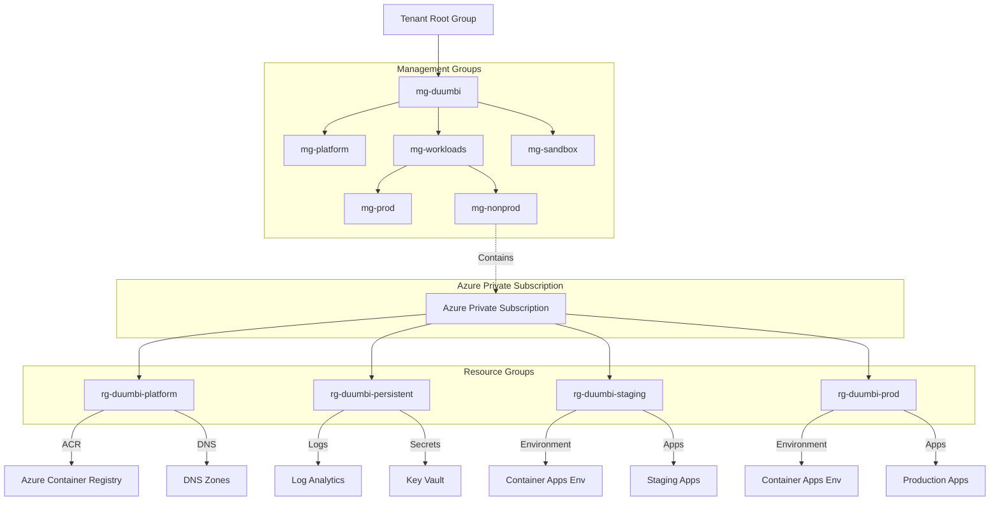

# Azure Governance & Hierarchy Structure

This document illustrates the proposed Azure hierarchy for the **Single Subscription MVP** model.

## Management Groups

The following Management Groups structure enables centralized policy management and future scalability:

| Management Group ID | Management Group Display Name | Purpose                                                                  |
| ------------------- | ----------------------------- | ------------------------------------------------------------------------ |
| mg-duumbi           | Duumbi Root                   | Root organization container for all Duumbi resources and policies        |
| mg-platform         | Duumbi Platform               | Shared platform services: Container Registry, DNS, Key Vault, networking |
| mg-workloads        | Duumbi Workloads              | Application workloads and business-logic services                        |
| mg-prod             | Duumbi Production             | Production-tier policies and compliance requirements                     |
| mg-nonprod          | Duumbi Non-Production         | Development and Staging policies, less restrictive governance            |
| mg-sandbox          | Duumbi Sandbox                | Personal experimentation and prototyping environment                     |

**Note**: Currently, we have only one Subscription ("Azure Private Subscription") placed under `mg-nonprod`. Future subscriptions can be moved under their corresponding Management Group as the organization grows.

## Hierarchy Diagram

## Explanation

### Management Groups (MG)
The complete structure is set up (`mg-platform`, `mg-prod`, etc.) to enable future subscription placement without restructuring. This provides forward compatibility for organizational growth and policy inheritance.

### Subscription
The single subscription ("Azure Private Subscription") logically resides under `mg-nonprod` initially. This structure simulates the complete organizational hierarchy while maintaining cost efficiency. In the future, as the organization matures, separate subscriptions can be created and organized under their respective Management Groups.

### Resource Groups (RG)
Resource Groups form the **actual separation layer** within the single subscription:
- **`rg-duumbi-platform`**: Shared platform infrastructure logically corresponding to `mg-platform` (ACR, DNS, KeyVault).
- **`rg-duumbi-persistent`**: Shared persistent infrastructure used across environments (Log Analytics, shared backups).
- **`rg-duumbi-staging`**: Environment-specific resources for Staging (Container Apps Environment, apps).
- **`rg-duumbi-prod`**: Environment-specific resources for Production (Container Apps Environment, apps).

### Tagging Strategy
To enable cost tracking and compliance across environments, all resources are tagged:
- `Environment`: `Production` | `Staging` | `Development` | `Platform`
- `CostCenter`: `Duumbi`
- `Owner`: Team name or individual responsible for the resource
- `ManagedBy`: `Pulumi` (for IaC-managed resources)
