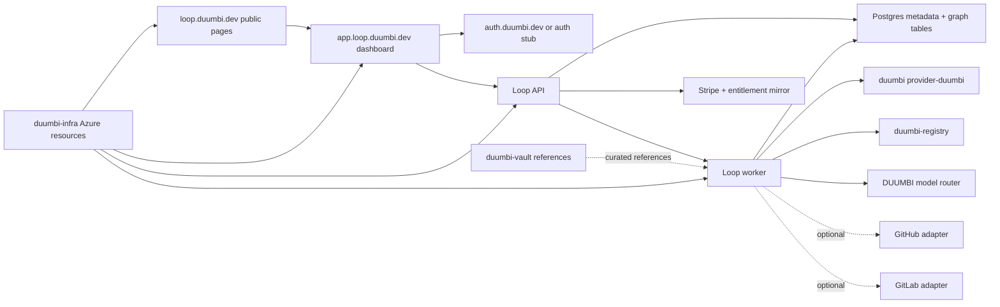

# DUUMBI-750: DUUMBI Loop Web And Infrastructure Experience Slice - Technical Specification

Spec for #750.

Related to #738. Builds on the merged provider-core/native CLI foundation in
#749.

This PR is specification-only and must leave #750 open. Do not use closing
references such as "closes", "fixes", or "resolves" for #750 or #738.

## Implementation Objective

Prepare a future Stage 10 implementation agent to build the next DUUMBI Loop
web and infrastructure slice without changing the #749 contract:

```text
DUUMBI-native provider foundation -> Loop app/API/dashboard -> optional adapters
```

The implementation must expose the product surfaces specified in
`specs/DUUMBI-750/PRODUCT.md`, while preserving these invariants:

- `provider-duumbi` remains the primary path.
- GitHub and GitLab remain adapters, not prerequisites.
- DUUMBI-owned model labels are the user-facing model contract.
- Billing, auth, privacy, cloud cost, and cross-repo ownership are explicit
  before hosted work starts.

Do not use this technical spec to create implementation code during the spec
PR. Do not start Ralph cycles from this spec PR. Do not invoke Greptile for this
spec PR.

## Agent Audience

- Stage 10 coordinator agents planning cross-repo work.
- Implementation agents working in `duumbi`, `duumbi-loop`, `duumbi-web`,
  `duumbi-infra`, `duumbi-registry`, and `duumbi-vault`.
- Review agents validating BDD-to-test coverage, security, privacy, billing,
  cost, and live E2E evidence.
- Human maintainers deciding auth, billing, cloud, and repo ownership gates.

## Source Context

Inspected before drafting:

- GitHub issue: https://github.com/hgahub/duumbi/issues/750
- Parent issue: https://github.com/hgahub/duumbi/issues/738
- Merged implementation PR: https://github.com/hgahub/duumbi/pull/749
- Parent product spec: `specs/DUUMBI-738/PRODUCT.md`
- Parent technical spec: `specs/DUUMBI-738/TECHNICAL.md`
- Stage 10 evidence: `docs/e2e/results/duumbi-738-native-loop-20260619.md`
- Native provider implementation: `src/loop_native/mod.rs`
- Native provider tests: `tests/integration_duumbi738_loop_native.rs`
- `duumbi-web` visual tokens: `src/styles/global.css`
- `duumbi-infra` Pulumi registry stack: `stack-registry.ts`
- `duumbi-registry` auth and server modules:
  - `src/lib.rs`
  - `src/auth/mod.rs`
  - `src/web/auth_routes.rs`
  - `src/db/mod.rs`
  - `src/types.rs`
- Vault Loop references:
  - `Duumbi/02 Resources (Assets and Tools)/Sources (References)/duumbi-loop-codex-task.md`
  - `Duumbi/02 Resources (Assets and Tools)/Sources (References)/duumbi-loop-codex-task-part2.md`

## Verified Current State

### `hgahub/duumbi`

#749 added `src/loop_native/mod.rs` with:

- `LoopProviderKind`
- `WorkflowKind`
- `LoopRunState`
- `ArtifactKind`
- `WorkItemSource`
- `WorkItem`
- `ContextSourceKind`
- `ContextSource`
- `ContextIndex`
- `ArtifactRef`
- `ArtifactEnvelope`
- `ReviewTargetKind`
- `ChangeSet`
- `ReviewTarget`
- `NativeRunResult`
- `DuumbiProvider`
- `run_native_intake_spec`
- `graph_patch_review_target`
- `validate_relative_artifact_ref`

It also added local/CLI E2E coverage proving native intake/spec and GraphPatch
review target mapping without Git credentials.

### `hgahub/duumbi-loop`

The local checkout is effectively empty except `.gitignore`. Treat this repo as
the likely application/API/workers scaffold target.

### `hgahub/duumbi-web`

Current stack:

- Astro 6
- Tailwind CSS 4
- MDX content
- public marketing pages
- docs site
- global brand tokens in `src/styles/global.css`

The inspected source tree does not contain a Loop app dashboard.

### `hgahub/duumbi-infra`

Current stack:

- TypeScript Pulumi
- Azure Native
- Azure AD
- Random provider
- registry Container App, DNS, storage, Log Analytics, secrets, and monitoring
  patterns

The inspected registry stack currently deploys `registry.duumbi.dev` with Azure
Container Apps, Azure Files, and scale-to-zero min replicas.

### `hgahub/duumbi-registry`

Current stack:

- Rust/Axum app with `build_app()` library surface
- SQLite metadata
- filesystem package storage
- local password auth
- GitHub OAuth
- JWT session cookies
- CLI device code flow
- web templates

Registry auth is useful precedent, but Loop should not create a permanent
second user silo if central DUUMBI SSO is adopted.

### `hgahub/duumbi-vault`

Vault references define the broader Loop direction:

- DUUMBI-native workflow is primary.
- GitHub/GitLab are adapters.
- Neon Postgres is the planned cloud metadata and graph default.
- Stripe is the default billing provider.
- Central DUUMBI SSO at `auth.duumbi.dev` is the desired identity boundary.
- Raw source retention, LLM data policy, billing lifecycle, settings,
  repository indexing, knowledge UI, staff monitoring, and notification
  behavior are already sketched and should inform implementation.

## Cross-Repo Ownership

| Repo | Owns | Must Not Own |
| --- | --- | --- |
| `duumbi` | Native provider-core types already delivered by #749, DUUMBI intent/session/graph/BDD/knowledge/registry primitives, local CLI proof paths, shared schemas only when they belong to DUUMBI core. | Hosted web app shell, billing UI, cloud tenant tables, Git provider cloud tokens. |
| `duumbi-loop` | Authenticated Loop app, Loop API, run orchestration, dashboard, billing mirror, tenant model, provider adapter orchestration, worker interfaces, app-specific DB migrations. | Core DUUMBI compiler semantics, public duumbi.dev docs unrelated to Loop, Azure stack definitions. |
| `duumbi-web` | Public Loop homepage or marketing/docs surfaces if they remain in the existing Astro site, shared visual language, docs links. | Authenticated dashboard unless an explicit architecture decision keeps app pages in Astro. |
| `duumbi-infra` | Azure DNS, Container Apps, Static Web Apps if used, Key Vault/secret references, budgets, alerts, queues, observability, hosted E2E stacks. | Product domain logic, auth user tables, billing calculations. |
| `duumbi-registry` | Registry package APIs, module metadata, registry auth migration/adaptation, graph-aware registry metadata APIs if approved. | Loop organization billing source of truth, dashboard run state, provider connection secrets outside registry scope. |
| `duumbi-vault` | Reference docs, product/architecture knowledge sources, manual planning records. | Runtime source of truth for production data or secrets. |

If central auth is implemented in a separate `duumbi-auth` repo, that repo owns
identity, sessions, OIDC/JWT issuer behavior, magic links, identity linking,
staff claims, and account lifecycle. If `duumbi-auth` is not included in the
first implementation slice, `duumbi-loop` must define an auth interface that can
be migrated to central SSO without changing organization, membership, billing,
or run ownership semantics.

## Proposed System Architecture



## Data Model Boundaries

The implementation can choose exact table names, but the following entities and
ownership boundaries are required.

### Identity And Tenant

`User`

- `id`
- `primary_email`
- `display_name`
- `avatar_url`
- `created_at`
- `updated_at`
- `deleted_at`

`Identity`

- `id`
- `user_id`
- `provider`
- `provider_subject`
- `email`
- `verified_at`
- `linked_at`

`Organization`

- `id`
- `slug`
- `name`
- `region_preference`
- `created_by`
- `created_at`
- `deleted_at`

`Membership`

- `organization_id`
- `user_id`
- `role`
- `status`
- `created_at`
- `updated_at`

`Invitation`

- `id`
- `organization_id`
- `email`
- `role`
- `token_hash`
- `status`
- `invited_by`
- `expires_at`
- `created_at`

### Billing And Entitlements

`BillingCustomer`

- `organization_id`
- `stripe_customer_id`
- `tax_region`
- `created_at`

`BillingSubscription`

- `organization_id`
- `stripe_subscription_id`
- `plan`
- `status`
- `current_period_start`
- `current_period_end`
- `cancel_at_period_end`

`BillingEntitlement`

- `organization_id`
- `key`
- `value`
- `source`
- `suspended`
- `updated_at`

`CreditLedgerEntry`

- `id`
- `organization_id`
- `delta`
- `kind`
- `run_id`
- `period`
- `expires_at`
- `created_at`

`UsageMeterEvent`

- `id`
- `organization_id`
- `run_id`
- `workflow_kind`
- `duumbi_model_label`
- `estimated_credits`
- `final_credits`
- `llm_cost_usd`
- `tokens_in`
- `tokens_out`
- `pricing_version`
- `created_at`

### Model Routing Policy

`ModelLabel`

- `label`
- `display_name`
- `description`
- `workflow_defaults`
- `is_active`

`ModelPolicy`

- `organization_id`
- `workflow_kind`
- `allowed_labels`
- `default_label`
- `max_credits_per_run`
- `max_context_tokens`
- `region_bucket`
- `allow_byok`
- `allow_platform_keys`
- `fallback_mode`
- `prompt_retention`
- `source_retention`

`ProviderCredential`

- `id`
- `organization_id`
- `provider_kind`
- `credential_scope`
- `encrypted_secret_ref`
- `status`
- `last_validated_at`
- `created_by`

Raw provider/model IDs are implementation metadata, not primary user choices.

### Providers And Repositories

`ProviderConnection`

- `id`
- `organization_id`
- `provider_kind`
- `display_name`
- `instance_url`
- `external_installation_id`
- `status`
- `permissions`
- `last_sync_at`
- `error_code`
- `created_by`

`RepositoryRegistration`

- `id`
- `organization_id`
- `provider_connection_id`
- `provider_repo_id`
- `native_workspace_ref`
- `name`
- `full_name`
- `default_branch`
- `status`
- `enabled`
- `retention_override`
- `strict_review_override`
- `last_indexed_at`
- `last_error`

`GraphSnapshot`

- `id`
- `organization_id`
- `repository_id`
- `source_kind`
- `commit_sha`
- `branch`
- `schema_version`
- `parser_version`
- `language_summary`
- `node_count`
- `edge_count`
- `storage_uri`
- `status`
- `created_at`

Native DUUMBI workspace registration can set `provider_connection_id = null`
and use `native_workspace_ref`.

### Loop Runs And Artifacts

`LoopRun`

- `id`
- `organization_id`
- `repository_id`
- `provider_kind`
- `work_item_id`
- `workflow_kind`
- `state`
- `duumbi_model_label`
- `triggered_by`
- `estimated_credits`
- `final_credits`
- `started_at`
- `completed_at`
- `superseded_by`
- `blocked_reason`

`LoopArtifact`

- `id`
- `organization_id`
- `run_id`
- `artifact_kind`
- `schema_version`
- `storage_uri`
- `markdown_storage_uri`
- `source_count`
- `created_at`

`ArtifactSource`

- `artifact_id`
- `source_kind`
- `reference`
- `summary`
- `truncated`

`ReviewTarget`

- `id`
- `run_id`
- `target_kind`
- `change_set_summary`
- `external_ref`
- `created_at`

`ReviewFinding`

- `id`
- `review_target_id`
- `severity`
- `title`
- `body`
- `acceptance_criterion_ref`
- `bdd_ref`
- `source_ref`
- `provider_comment_status`

`QuestionTopic`

- `id`
- `run_id`
- `status`
- `title`
- `body`
- `required`
- `resolved_by`
- `resolved_at`

### Knowledge And Audit

`KnowledgeEntry`

- `id`
- `organization_id`
- `repository_id`
- `entry_type`
- `status`
- `title`
- `body_markdown`
- `source_run_id`
- `provenance`
- `created_by`
- `updated_by`
- `deprecated_reason`
- `created_at`
- `updated_at`

`AuditEvent`

- `id`
- `organization_id`
- `actor_user_id`
- `actor_kind`
- `event_type`
- `target_type`
- `target_id`
- `metadata_json`
- `created_at`

## API Boundaries

API names are suggested. Exact routing can change if the implementation uses an
established local pattern, but the boundaries must remain.

### Identity And Organization

```http
GET  /api/me
PATCH /api/me
GET  /api/orgs
POST /api/orgs
GET  /api/orgs/{org_id}
PATCH /api/orgs/{org_id}

GET  /api/orgs/{org_id}/members
PATCH /api/orgs/{org_id}/members/{user_id}
DELETE /api/orgs/{org_id}/members/{user_id}

GET  /api/orgs/{org_id}/invitations
POST /api/orgs/{org_id}/invitations
DELETE /api/invitations/{invitation_id}
POST /api/invitations/accept
```

### Account Lifecycle

Account routes are organization-independent unless an organization context is
explicitly supplied for notification preferences or scoped tokens.

```http
GET    /api/me/identities
POST   /api/me/identities/{provider}/link
DELETE /api/me/identities/{identity_id}

GET    /api/me/sessions
DELETE /api/me/sessions/{session_id}
DELETE /api/me/sessions

GET    /api/me/tokens
POST   /api/me/tokens
DELETE /api/me/tokens/{token_id}

GET    /api/me/notifications
PUT    /api/me/notifications

POST   /api/me/export
GET    /api/me/export/{job_id}
DELETE /api/me
```

Account lifecycle implementations must prove:

- identity unlink leaves at least one usable login identity,
- session revoke takes effect server-side,
- raw personal API tokens are shown once and stored hashed,
- account export jobs are scoped to the requesting user,
- account deletion is blocked until sole-owner organizations are transferred or
  deleted.

### Dashboard And Runs

```http
GET  /api/orgs/{org_id}/dashboard
GET  /api/orgs/{org_id}/runs
POST /api/orgs/{org_id}/runs
GET  /api/runs/{run_id}
POST /api/runs/{run_id}/cancel
POST /api/runs/{run_id}/rerun
GET  /api/runs/{run_id}/artifacts
GET  /api/artifacts/{artifact_id}
GET  /api/runs/{run_id}/questions
POST /api/questions/{topic_id}/reply
POST /api/questions/{topic_id}/resolve
```

`POST /api/orgs/{org_id}/runs` must support native DUUMBI work items without a
Git provider connection.

### Providers And Repositories

```http
GET  /api/orgs/{org_id}/providers
POST /api/orgs/{org_id}/providers/{provider_kind}/connect
POST /api/providers/{provider_connection_id}/sync
POST /api/providers/{provider_connection_id}/reconnect
DELETE /api/providers/{provider_connection_id}

GET  /api/orgs/{org_id}/repositories
POST /api/orgs/{org_id}/repositories
PATCH /api/repositories/{repository_id}
POST /api/repositories/{repository_id}/enable
POST /api/repositories/{repository_id}/disable
POST /api/repositories/{repository_id}/reindex
GET  /api/repositories/{repository_id}/graph/snapshots
GET  /api/repositories/{repository_id}/graph/summary
POST /api/repositories/{repository_id}/graph/query
```

### Knowledge

```http
GET  /api/orgs/{org_id}/knowledge
POST /api/orgs/{org_id}/knowledge
GET  /api/knowledge/{entry_id}
PATCH /api/knowledge/{entry_id}
POST /api/knowledge/{entry_id}/approve
POST /api/knowledge/{entry_id}/reject
POST /api/knowledge/{entry_id}/deprecate
GET  /api/orgs/{org_id}/knowledge/export
```

### Configuration, Billing, And Usage

```http
GET  /api/orgs/{org_id}/settings
PATCH /api/orgs/{org_id}/settings
GET  /api/orgs/{org_id}/model-policy
PUT  /api/orgs/{org_id}/model-policy
GET  /api/orgs/{org_id}/usage
GET  /api/orgs/{org_id}/billing
POST /api/orgs/{org_id}/billing/checkout-session
POST /api/orgs/{org_id}/billing/cancel
POST /api/orgs/{org_id}/billing/reactivate
POST /api/orgs/{org_id}/billing/credits/purchase
POST /api/webhooks/stripe
```

`POST /api/webhooks/stripe` is public ingress authenticated by Stripe signature
verification, not by user session. It must ingest Stripe events idempotently,
persist the raw event envelope or stable event reference for replay/audit, and
update `BillingSubscription`, `BillingEntitlement`, `CreditLedgerEntry`, and
related dunning state through the materialized billing mirror. Request-time
checkout, dashboard, run-preflight, and repository-limit paths must read this
mirror and must not call live Stripe APIs for entitlement decisions.

### Staff

```http
GET  /staff/api/overview
GET  /staff/api/orgs
GET  /staff/api/orgs/{org_id}
GET  /staff/api/users
GET  /staff/api/billing
GET  /staff/api/ops
POST /staff/api/orgs/{org_id}/suspend
POST /staff/api/orgs/{org_id}/unsuspend
POST /staff/api/orgs/{org_id}/entitlement-override
```

All staff APIs require staff authorization and audited access.

## UI Route Boundaries

Public:

```text
/
/pricing
/security
/docs or docs.duumbi.dev/loop
```

Authenticated:

```text
/login
/invite/:token
/o/:org
/o/:org/runs
/o/:org/runs/:runId
/o/:org/intake
/o/:org/reviews
/o/:org/repositories
/o/:org/repositories/:repoId
/o/:org/providers
/o/:org/knowledge
/o/:org/knowledge/:entryId
/o/:org/settings
/o/:org/settings/members
/o/:org/settings/billing
/o/:org/settings/usage
/o/:org/settings/model-policy
/o/:org/settings/retention
/o/:org/settings/notifications
/o/:org/settings/api-tokens
/o/:org/settings/audit-log
/account/profile
/account/identities
/account/sessions
/account/tokens
/account/notifications
/account/danger
/staff/overview
/staff/orgs
/staff/users
/staff/billing
/staff/ops
```

## Security And Privacy Requirements

### Auth And Session

- Use central SSO if approved; otherwise implement an auth adapter interface
  with local test identity.
- Session cookies are `HttpOnly`, `Secure`, and rotated.
- CSRF protection is required for cookie-authenticated mutating routes.
- Role checks must be server-side.
- Organization ID from route or body must never be trusted without membership
  authorization.
- Staff claims must be separate from organization roles.

### Secrets

- Never expose provider tokens, LLM keys, Stripe secrets, webhook secrets, JWT
  signing secrets, session secrets, or encryption keys to frontend bundles.
- Store long-lived secrets in managed secret infrastructure or encrypted secret
  references.
- Store API tokens hashed; display raw token only once.
- Redact secrets from logs, analytics, audit metadata, artifacts, and error
  responses.

### Source, Knowledge, And LLM Context

- Do not send full repository dumps to LLM providers.
- Build bounded source packs with explicit sources, truncation markers, and
  policy filtering.
- Apply `.gitignore`, `.duumbiignore`, and default binary/build exclusions
  before source indexing.
- Retention policy must cover raw source snapshots, prompts, responses,
  snippets, artifacts, and graph snapshots.
- Tenant data must not cross organization boundaries in search, graph query,
  context assembly, analytics, or model routing.

### Provider Adapter Security

- GitHub/GitLab tokens are optional and scoped to connected organizations.
- GitLab Self-Hosted base URLs require SSRF defense:
  - `https://` only,
  - reject loopback, link-local, private IP ranges, metadata endpoints, and
    DNS rebinding results,
  - short timeouts,
  - rate limits,
  - explicit connection test.
- Webhooks require signature validation and idempotency keys.

### Billing And Payments

- Stripe webhook events must be idempotent.
- Billing source of truth is Stripe plus materialized entitlement mirror.
- Request-time API paths must use the entitlement mirror, not live Stripe calls.
- Payment card details never touch DUUMBI servers.
- Dunning and inactive subscriptions block new spend while preserving read
  access to existing artifacts as policy allows.

## Billing, Subscription, And Cloud-Cost Constraints

### Credit Enforcement

Before enqueuing a costly run:

1. Resolve organization entitlement.
2. Resolve model policy.
3. Estimate credits.
4. Compare estimate to credit balance.
5. Compare estimate to `max_credits_per_run`.
6. Check billing/subscription status.
7. Check repository and role permissions.
8. Only then enqueue.

If any check fails, return a typed block reason and do not enqueue the run.

### Routing Cost Rules

- Platform-key routing can select only models with curated pricing.
- BYOK routing can allow unknown provider pricing only with conservative
  estimated credits and explicit "estimated" marker.
- Every completed run records estimated and final credits.
- Every LLM call records enough usage metadata to reconcile credits without
  storing raw prompts in analytics.

### Cloud Budget Rules

- Hosted E2E must run in test mode with explicit resource names and teardown or
  scale-to-zero behavior.
- Default Container Apps settings must include low min replicas for non-prod.
- Workers must enforce max runtime and max queued retry count.
- Queues require DLQ and replay policy.
- Alerts must exist for high daily LLM spend, failed Stripe webhook processing,
  DLQ growth, and negative margin candidates.

## BDD-To-Test Mapping

| Product scenario | Required tests | Target repo(s) |
| --- | --- | --- |
| Homepage presents DUUMBI-native Loop | Browser snapshot/assertion test for `loop.duumbi.dev` route text, workflow ordering, optional adapter copy, and duumbi.dev token use. | `duumbi-web` or `duumbi-loop` depending route ownership |
| Login creates an organization session | Auth integration test with magic-link test adapter; account lifecycle API tests for profile/session/token/export/delete boundaries; Playwright login/onboarding flow. | `duumbi-loop`, auth repo if created |
| Invited user joins an existing organization | API integration test for invitation lifecycle; identity-linking conflict test; Playwright invitation acceptance. | `duumbi-loop`, auth repo if created |
| Dashboard shows active Loop work | Component/API test for dashboard summary states; Playwright dashboard rendering with seeded runs. | `duumbi-loop` |
| Dashboard shows subscription usage before spend | API test for entitlement/credit summary; Stripe webhook idempotency and entitlement mirror update test; Playwright run-start block/allow states. | `duumbi-loop` |
| Native workflow can start without Git provider credentials | Integration test that creates a native run with no provider connection rows and no Git tokens; should call #749 native path or fixture adapter. | `duumbi-loop`, `duumbi` |
| Git provider connection is optional | UI test for provider empty state and native CTA; API test that native run creation does not require provider connection. | `duumbi-loop` |
| Provider revocation disables dependent repositories | Provider webhook unit/integration test; repository state transition test; artifact readability assertion. | `duumbi-loop` |
| Repository registration triggers indexing status | API integration test for enable -> queued; worker unit test for indexing state transitions; UI table assertion. | `duumbi-loop` |
| Plan limit blocks repository enablement | Entitlement unit test; API test returning plan-limit block; UI remediation assertion. | `duumbi-loop` |
| Knowledge candidate approval updates usable context | API integration test for candidate -> published; context assembly test includes published entry and excludes rejected one. | `duumbi-loop` |
| Configuration controls model and data policy | Model policy validation tests; run preflight tests for label, region, retention, and max credits. | `duumbi-loop` |
| Intake uses research and knowledge context | Worker integration test with graph, registry, and knowledge fixtures; artifact source assertions. | `duumbi-loop`, `duumbi` |
| Intake blocks on unresolved required questions | Run state machine test for `needs_input`; API/UI tests for question resolution and waived audit evidence. | `duumbi-loop` |
| Review supports GraphPatch target | Integration test using `duumbi::loop_native::graph_patch_review_target`; UI review rendering test. | `duumbi-loop`, `duumbi` |
| Review supports optional Git adapter diff | Adapter contract test with mocked provider diff and inline-comment limits; UI full-findings assertion. | `duumbi-loop` |
| DUUMBI model labels hide provider routing | API and UI tests assert DUUMBI label is exposed while raw provider/model is admin/audit metadata only. | `duumbi-loop` |
| Cloud-cost policy fails closed | Run enqueue preflight test for over-cap estimate; no queue message emitted; UI block reason assertion. | `duumbi-loop` |
| Staff access is audited | Staff authorization test; audit event assertion; UI support banner assertion. | `duumbi-loop` |

## Test Strategy

### Unit Tests

- Role and capability matrix.
- State machine transitions.
- Entitlement resolution.
- Credit estimation and block reasons.
- Model label policy validation.
- Provider connection lifecycle.
- SSRF URL validation.
- Knowledge status transitions.
- Artifact source redaction.

### Integration Tests

- API tests with isolated test database.
- Stripe webhook test-mode event ingestion and idempotency.
- Native run creation without provider credentials.
- Provider adapter contract tests with mocked GitHub/GitLab clients.
- Registry metadata lookup through test fixtures.
- Knowledge context assembly with tenant isolation.
- GraphPatch review target mapping through #749 native types.

### Browser/E2E Tests

- Homepage visual/content checks.
- Login/onboarding flow.
- Dashboard state with seeded runs.
- Provider empty state.
- Repository enable plan-limit block.
- Intake detail with sources and questions.
- Review detail with GraphPatch findings.
- Billing usage panel and run-start cost block.

### Static And Security Tests

- Secret scanning for frontend bundles and artifacts.
- CSRF and cookie attribute assertions.
- Authorization negative tests across organization boundaries.
- SSRF unit tests for GitLab Self-Hosted URLs.
- Analytics payload tests ensuring no source, prompt, token, or payment detail.

## Live E2E Plan

### Phase 1: Local No-Cost E2E

Purpose: prove the app slice without cloud spend or external provider
credentials.

Environment:

- local `duumbi-loop` API/app,
- local test database,
- local auth test adapter or central-auth test mode,
- mocked Stripe test adapter,
- mocked Git providers,
- #749 `duumbi` native provider fixture,
- local registry fixture or in-memory `duumbi-registry::build_app()`.

Required proof:

- user logs in,
- organization is created,
- dashboard loads,
- native intake starts with no Git provider connection,
- run uses graph/knowledge/registry fixture context,
- estimated credits are checked before queue,
- artifact appears,
- GraphPatch review target renders,
- no GitHub/GitLab token is present.

Expected external LLM calls: 0.

### Phase 2: Hosted Smoke E2E

Purpose: prove minimal cloud wiring with controlled cost.

Environment:

- Azure non-prod resources from `duumbi-infra`,
- test-mode Stripe,
- test auth issuer,
- low-replica/scale-to-zero Container Apps,
- Postgres test branch or approved low-cost database,
- seeded organization and fixture data.

Required proof:

- app route is reachable over HTTPS,
- API health is reachable,
- auth callback/session works,
- dashboard loads seeded state,
- run preflight blocks over-cap estimates,
- queue/worker handles a no-cost fixture run,
- logs and metrics appear,
- budget/alert resources exist.

No live provider/model spend is allowed in this phase unless explicitly
approved.

### Phase 3: Adapter Smoke E2E

Purpose: prove optional adapters remain optional and do not fork the domain
model.

Environment:

- mocked provider webhooks first,
- later a sandbox GitHub/GitLab project if approved.

Required proof:

- provider connection creates `ProviderConnection`,
- repository sync creates `RepositoryRegistration`,
- adapter work item maps into the same `LoopRun` and `LoopArtifact` model,
- provider revocation disables dependent repositories,
- native no-provider run still works afterward.

## Ralph Cycle Resource Policy

This spec PR:

- Ralph cycles: 0
- Implementation code: 0
- External LLM calls required by spec artifacts: 0
- GitHub/GitLab credentials required: no
- Greptile: not allowed

Future implementation Ralph cycles:

- Use local/no-cost cycles first.
- One Ralph cycle may cover only one bounded implementation objective.
- Each cycle must declare expected external calls and cost before starting.
- Default cycle cap: no external LLM calls unless the issue-specific Stage 10
  prompt authorizes them.
- Cloud cycles require an explicit budget, resource list, teardown/scale-to-zero
  rule, and evidence file.
- Stop a cycle if it needs production secrets, live payment changes, unapproved
  cloud resources, cross-repo write access not granted, or ambiguous auth/billing
  ownership.

## Implementation Boundaries For Stage 10

The next implementation stage should be split into small PRs unless maintainers
explicitly approve a larger coordinated branch:

1. `duumbi-loop` scaffold with API/app/test harness and domain model stubs.
2. Local auth adapter or central-auth integration boundary.
3. Billing entitlement and credit preflight shell with Stripe test adapter.
4. Dashboard summary and run list over seeded/local data.
5. Native run creation path calling or mirroring #749 provider-duumbi artifacts.
6. Knowledge and configuration UI/API shell.
7. GraphPatch review UI/API shell.
8. Optional provider registration shell with adapters mocked.
9. `duumbi-web` Loop homepage or public route update.
10. `duumbi-infra` non-prod hosted smoke resources only after cloud gates pass.

Do not implement all pages as static mockups without backing API contracts. The
first useful slice should connect at least login/session, organization,
dashboard, billing preflight, and native run creation in local E2E.

## Build Blockers To Resolve Before Hosted Implementation

These are build-stage blockers, not spec-drafting blockers:

- Auth ownership: central `auth.duumbi.dev` repo/service now, or `duumbi-loop`
  auth adapter with migration path.
- Database ownership: Neon Postgres approval for Loop metadata and graph tables,
  or approved temporary local/Postgres substitute.
- Billing values: Stripe test products, entitlement keys, credit unit, and
  initial plan limits.
- Cloud resources: approved Azure resource names, budget cap, and hosted E2E
  teardown/scale-to-zero policy.
- Cross-repo write access: which repos Stage 10 agents may edit and which PR
  sequence is expected.
- Vault import policy: which `duumbi-vault` sources may be used in hosted runs.
- Model routing: which DUUMBI labels are active in implementation and which
  provider classes are permitted in local and hosted tests.

If any of these remain unresolved during Stage 10, stop with findings instead
of improvising product or infrastructure ownership.

## Stage 10 Implementation Prompt

Use this prompt only after the spec PR is approved and the issue is moved to
Ready for Build:

```text
Run DUUMBI Stage 10 implementation for #750 using
specs/DUUMBI-750/PRODUCT.md and specs/DUUMBI-750/TECHNICAL.md.

Target issue: https://github.com/hgahub/duumbi/issues/750
Parent context:
- #738 delivered the DUUMBI-native Loop core direction.
- #749 delivered the provider-core/native CLI foundation in hgahub/duumbi.
- Do not claim the full DUUMBI Loop product is complete.

Goal: implement the first web+infra slice that connects the DUUMBI-native Loop
foundation to a user-facing Loop experience.

Required behavior:
- preserve provider-duumbi as the primary path,
- keep GitHub/GitLab optional adapters,
- do not require Git provider credentials for the native path,
- expose DUUMBI-owned model labels rather than raw provider/model SKUs,
- implement a local/no-cost E2E path before hosted cloud work,
- follow the BDD-to-test mapping, security/privacy requirements,
  billing/subscription/cloud-cost constraints, live E2E plan, and Ralph Cycle
  resource policy in the technical spec.

Stop with findings if product scope, architecture ownership, security, billing,
cloud cost, auth, or cross-repo access creates a blocker.

Use non-closing references to #750 in all PRs until final workflow closure.
Greptile is reserved for final implementation PR review, not spec PRs.
```
