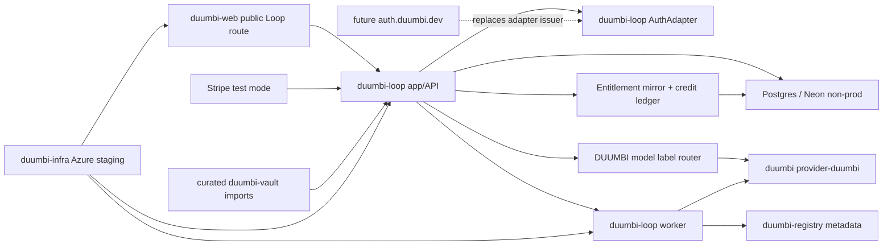

# DUUMBI-757: DUUMBI Loop Production Integration Slice - Technical Specification

Spec for #757.

Related to #738 and #750.

This PR is specification-only and must leave #757 open. Do not use closing
references such as "closes", "fixes", or "resolves" for #757, #750, or #738.

## Implementation Objective

Prepare a Stage 10 implementation agent to build the first production-shaped
DUUMBI Loop staging integration without claiming full product completion.

The implementation must connect the local #750 `duumbi-loop` proof to:

- Postgres persistence,
- a replaceable `AuthAdapter`,
- Stripe test-mode entitlement mirroring,
- deterministic no-spend DUUMBI model routing,
- curated hosted vault import,
- Azure staging resources with budget and scale-to-zero controls,
- public Loop entry point integration using the duumbi.dev visual language.

Invariants:

- `provider-duumbi` remains the primary path.
- GitHub/GitLab remain optional adapters, not prerequisites.
- DUUMBI-owned model labels are the user-facing model contract.
- Raw provider/model SKUs are admin/audit metadata only.
- Hosted smoke must not require production auth, live Stripe products, live
  model spend, real Git provider credentials, or Ralph cycles.

## Agent Audience

- Stage 10 implementation coordinator.
- `duumbi-loop` app/API/worker implementers.
- `duumbi-web` public route implementers.
- `duumbi-infra` Azure staging implementers.
- Security, billing, and operations reviewers.
- Future agents deciding whether a later central `auth.duumbi.dev` service is
  needed.

## Verified Current State

### `hgahub/duumbi`

PR #749 is merged and provides `duumbi::loop_native` and CLI support for native
intake/spec and GraphPatch review targets. This spec does not require changes
to DUUMBI core unless implementation discovers a contract gap that cannot be
owned cleanly in `duumbi-loop`.

### `hgahub/duumbi-loop`

PR #1 is merged and provides:

- Rust/Axum API and server-rendered local app scaffold,
- local auth adapter and secure session cookie,
- in-memory organization/session/account lifecycle shell,
- entitlement and credit preflight shell,
- Stripe-shaped signed webhook boundary with idempotency,
- dashboard/runs/providers/billing pages over seeded data,
- native no-Git run path using #749 `provider-duumbi`,
- GraphPatch review target evidence,
- local Stage 10 evidence with 0 external LLM calls, 0 Git provider
  credentials, 0 hosted cloud resources, 0 live Stripe calls, and 0 Ralph
  cycles.

### `hgahub/duumbi-web`

The current Astro/Tailwind site owns the duumbi.dev public visual language. The
production-integration slice should add a public Loop route here unless
implementation proves that a `duumbi-loop` hosted public page is less risky.

### `hgahub/duumbi-infra`

The current Pulumi stack already has Azure Native, Key Vault, Log Analytics, and
budget patterns. The Loop staging stack must reuse these patterns but define
separate approved non-prod Loop resources.

### `hgahub/duumbi-registry`

The registry remains read-only for this slice unless a metadata API boundary is
needed. Its auth implementation is precedent only and must not become the Loop
billing or tenant source of truth.

### `hgahub/duumbi-vault`

Vault content is reference material and curated import source material only. It
must not become runtime source of truth for production data or secrets.

## Cross-Repo Ownership And PR Order

| Order | Repo | Owns In This Slice | Must Not Own |
| ---: | --- | --- | --- |
| 1 | `hgahub/duumbi` | Spec artifacts. Core contract updates only if `duumbi-loop` cannot express a required native provider boundary. | Hosted app, billing tables, Azure resources. |
| 2 | `hgahub/duumbi-loop` | AuthAdapter, API/app, Postgres migrations, repositories, billing mirror, credit ledger, model policy, no-spend router, worker, hosted smoke endpoints. | Public duumbi.dev marketing system, Azure stack definitions, DUUMBI core compiler semantics. |
| 3 | `hgahub/duumbi-web` | Public Loop route, duumbi.dev visual language integration, request-access/sign-in entry point. | Authenticated dashboard domain logic, billing calculations, run orchestration. |
| 4 | `hgahub/duumbi-infra` | Azure staging resources, budgets, DNS, Container Apps, Key Vault references, Log Analytics, queue/storage resources, outputs for E2E. | Product logic, tenant tables, credit calculations. |
| 5 | `hgahub/duumbi-registry` | Read-only registry metadata boundary if required. | Loop organization, billing, auth, or dashboard ownership. |
| 6 | `hgahub/duumbi-vault` | Curated docs/reference entries and allowlist inputs. | Runtime source of truth, secrets, credentials, production database content. |

Implementation should use separate PRs unless a maintainer explicitly approves a
single coordinated branch. The first implementation PR should target
`duumbi-loop` and land Postgres/AuthAdapter/billing/model-router boundaries
before hosted Azure work.

## System Architecture



## Auth Boundary

`duumbi-loop` owns an `AuthAdapter` trait or equivalent boundary.

Required behavior:

- validate login callback or local/test token,
- produce stable internal user identity,
- create, rotate, revoke, and inspect sessions,
- expose identity provider metadata,
- support future issuer/subject mapping from `auth.duumbi.dev`,
- keep organization, membership, billing, run, artifact, and audit objects
  independent from the auth provider implementation.

Recommended contract:

```rust
trait AuthAdapter {
    fn adapter_name(&self) -> &'static str;
    async fn start_login(&self, return_to: ReturnTo) -> Result<LoginChallenge>;
    async fn complete_login(&self, request: AuthCallback) -> Result<AuthPrincipal>;
    async fn refresh_session(&self, session: SessionRef) -> Result<AuthPrincipal>;
    async fn revoke_session(&self, session: SessionRef) -> Result<()>;
}
```

Staging may use a test adapter. Production auth is not required in this slice.

## Postgres Data Model And Migration Plan

Use Postgres-compatible migrations owned by `duumbi-loop`. Exact migration tool
is implementation-owned, but migrations must be repeatable in CI and runnable
against local Postgres and Neon non-prod.

### Migration 0001: Identity, Tenant, And Audit

Tables:

- `users`
- `identities`
- `sessions`
- `organizations`
- `memberships`
- `invitations`
- `api_tokens`
- `export_jobs`
- `audit_events`

Minimum requirements:

- user IDs are stable internal IDs,
- identity provider/subject pairs are unique,
- sessions are server-side revocable,
- session secrets/tokens are stored hashed where applicable,
- organization slug is unique,
- membership role is server-authorized,
- audit events include actor, organization, action, target, timestamp, and
  request correlation ID.

### Migration 0002: Billing And Entitlements

Tables:

- `billing_customers`
- `billing_subscriptions`
- `billing_entitlements`
- `credit_ledger_entries`
- `usage_meter_events`
- `stripe_events`

Minimum requirements:

- Stripe event IDs are unique and idempotent,
- raw event storage is redacted or encrypted according to security policy,
- entitlement values are materialized and typed,
- credit debits and grants are ledger entries, not destructive balance updates
  only,
- request-time preflight reads the entitlement mirror, not live Stripe.

### Migration 0003: Loop Runs, Artifacts, And Knowledge

Tables:

- `repository_registrations`
- `provider_connections`
- `loop_runs`
- `loop_run_events`
- `loop_artifacts`
- `review_targets`
- `knowledge_entries`
- `vault_import_sources`
- `question_topics`

Minimum requirements:

- native workspace references do not require Git provider rows,
- run state transitions are auditable,
- artifacts store references and metadata, not unbounded raw source dumps,
- knowledge entries include provenance and approval status,
- vault import rows include allowlist decision and exclusion reason when
  rejected.

### Migration 0004: Model Policy And Routing Audit

Tables:

- `model_labels`
- `model_policies`
- `model_route_decisions`

Minimum requirements:

- labels use DUUMBI-owned values,
- raw provider/model SKU fields are nullable admin/audit metadata,
- `platform_keys_allowed` gates live platform-key provider spend,
- no-spend staging route decisions are visible in audit metadata.

## Billing And Entitlement Model

Stripe test products:

- `duumbi_loop_starter_test`
- `duumbi_loop_team_test`

Entitlement keys:

- `seat_limit`
- `repository_limit`
- `parallel_run_limit`
- `included_monthly_credits`
- `purchased_credits`
- `max_credits_per_run`
- `allowed_model_labels`
- `retention_days`
- `byok_allowed`
- `platform_keys_allowed`

Plan defaults:

| Plan | `seat_limit` | `repository_limit` | `parallel_run_limit` | `included_monthly_credits` | `max_credits_per_run` |
| --- | ---: | ---: | ---: | ---: | ---: |
| Starter | 1 | 3 | 1 | 1000 | 25 |
| Team | 10 | 25 | 3 | 10000 | 100 |

Run preflight sequence:

1. Resolve user and organization membership.
2. Resolve billing subscription and entitlement mirror.
3. Resolve model policy and requested DUUMBI model label.
4. Estimate credits.
5. Check billing status.
6. Check credit balance.
7. Check `max_credits_per_run`.
8. Check `parallel_run_limit`.
9. Check repository/native workspace state.
10. Only then create run and enqueue work.

If any check fails, return a typed block reason and do not create a run, worker
job, credit debit, model route decision, or external call.

## API Boundaries

Exact route names may follow local conventions, but these boundaries must exist.

### Auth And Account

```http
GET  /login
POST /login
GET  /auth/callback
POST /logout

GET    /api/me
PATCH  /api/me
GET    /api/me/identities
DELETE /api/me/identities/{identity_id}
GET    /api/me/sessions
DELETE /api/me/sessions/{session_id}
DELETE /api/me/sessions
GET    /api/me/tokens
POST   /api/me/tokens
DELETE /api/me/tokens/{token_id}
POST   /api/me/export
GET    /api/me/export/{job_id}
DELETE /api/me
```

### Organizations

```http
GET  /api/orgs
POST /api/orgs
GET  /api/orgs/{org_id}
PATCH /api/orgs/{org_id}

GET    /api/orgs/{org_id}/members
POST   /api/orgs/{org_id}/invitations
POST   /api/invitations/accept
DELETE /api/invitations/{invitation_id}
```

### Dashboard, Runs, And Review

```http
GET  /api/orgs/{org_id}/dashboard
GET  /api/orgs/{org_id}/runs
POST /api/orgs/{org_id}/runs/preflight
POST /api/orgs/{org_id}/runs
GET  /api/runs/{run_id}
POST /api/runs/{run_id}/cancel
GET  /api/runs/{run_id}/artifacts
GET  /api/runs/{run_id}/review-targets
```

`POST /api/orgs/{org_id}/runs` must support native DUUMBI work items without
Git provider credentials.

### Billing

```http
GET  /api/orgs/{org_id}/billing
GET  /api/orgs/{org_id}/usage
POST /api/orgs/{org_id}/billing/test-checkout-session
POST /api/webhooks/stripe
```

`POST /api/webhooks/stripe` is public ingress authenticated by Stripe signature
verification and timestamp tolerance. It must be idempotent.

### Knowledge And Vault Import

```http
GET  /api/orgs/{org_id}/knowledge
POST /api/orgs/{org_id}/knowledge
POST /api/orgs/{org_id}/knowledge/imports/vault
GET  /api/orgs/{org_id}/knowledge/imports
GET  /api/knowledge/{entry_id}
POST /api/knowledge/{entry_id}/approve
POST /api/knowledge/{entry_id}/reject
```

Hosted vault import must enforce the allowlist before reading/importing content.

### Model Policy

```http
GET /api/orgs/{org_id}/model-policy
PUT /api/orgs/{org_id}/model-policy
GET /api/orgs/{org_id}/model-route-decisions
```

User-facing APIs expose DUUMBI labels. Admin/audit APIs may expose route
metadata if authorized.

### Health And Operations

```http
GET /health
GET /ready
GET /ops/cost-policy
GET /ops/e2e-evidence
```

Operations endpoints must not expose secrets, raw prompts, source code,
provider tokens, payment details, or personal contact data.

## UI Route Boundaries

Public:

```text
/loop or /loop/staging
```

Authenticated:

```text
/login
/o/:org
/o/:org/runs
/o/:org/runs/:runId
/o/:org/settings/billing
/o/:org/settings/model-policy
/o/:org/knowledge
/o/:org/knowledge/imports
```

The implementation may retain #750 server-rendered pages for the app and add
only the minimal public route needed for staging entry.

## Azure Staging Boundary

Approved resource names:

- `rg-duumbi-loop-staging`
- `cae-duumbi-loop-staging`
- `ca-duumbi-loop-web-staging`
- `ca-duumbi-loop-worker-staging`
- `stduumbiloopstaging`
- `kv-duumbi-loop-staging`
- `log-duumbi-loop-staging`
- `staging.loop.duumbi.dev`

Required controls:

- USD 20/month non-prod Loop budget cap,
- alerts at 50/80/100 percent,
- max replicas 1 in staging,
- scale-to-zero where supported,
- worker disabled unless explicit E2E queue test runs,
- no live provider/model spend,
- no production secrets in Pulumi config or repository files,
- tags sufficient to identify Project, Environment, Owner, and CostCenter.

Implementation should add infrastructure only after `duumbi-loop` has stable
health, readiness, configuration, and image/container boundaries.

## Security And Privacy Requirements

### Auth And Session

- Session cookies must be `HttpOnly`, `Secure`, and `SameSite=Lax` or stricter.
- Session IDs and API tokens must be high entropy.
- Server-side session revocation must take effect immediately.
- CSRF protection is required for cookie-authenticated mutating routes.
- Organization authorization must be checked server-side for every
  organization-scoped route.
- Staff/admin access, if added, must be separate from organization roles and
  audited.

### Secrets

- Provider tokens, LLM keys, Stripe secrets, webhook secrets, JWT/session
  signing secrets, encryption keys, database passwords, and Pulumi secrets must
  not appear in frontend bundles, logs, specs, issue comments, or evidence
  files.
- Store long-lived secrets in Key Vault or an approved secret reference.
- Store raw API tokens only at creation time; persist hashes.
- Redact secrets from audit/events/errors.

### Tenant And Data Isolation

- Every run, artifact, knowledge entry, repository registration, billing record,
  model policy, and audit event must be organization-scoped.
- Cross-organization reads and writes require negative tests.
- Raw source dumps must not be stored or sent to model providers.
- Prompt/source retention policy must be represented before live model routing.

### Stripe

- Verify webhook signature and timestamp tolerance.
- Store processed event IDs for idempotency.
- Do not call live Stripe during request-time entitlement checks.
- Never accept card data in DUUMBI servers.
- Test-mode keys only for this slice.

### Hosted Vault Import

- Import only allowlisted curated references.
- Reject Inbox, personal notes, secrets, credentials, raw attachments, and
  unreviewed drafts.
- Record provenance, approval state, importer, timestamp, and exclusion reason.
- Imported content must not become usable context until approved.

### Model Routing

- User APIs and UI expose DUUMBI labels only.
- Raw provider/model route metadata is admin/audit only.
- `platform_keys_allowed=false` blocks live platform-key provider spend.
- No-spend staging router must be deterministic and testable.

## Billing, Subscription, And Cloud-Cost Constraints

- Stripe test mode only.
- Entitlement mirror is the request-time source of truth.
- Credit ledger must be append-only for grants/debits/adjustments.
- Run preflight must fail closed before queue/write when over cap or exhausted.
- Every accepted run records estimated credits and model label.
- Every completed run records final credits.
- Hosted smoke expected live provider/model cost is USD 0.
- Hosted smoke expected external LLM calls is 0 unless a later issue explicitly
  approves live spend.
- Azure budget evidence must be captured before a hosted smoke is accepted.

## BDD-To-Test Mapping

| Product scenario | Required tests | Target repo(s) |
| --- | --- | --- |
| Public Loop entry point uses duumbi.dev visual language | Browser or snapshot test asserting route content, DUUMBI Loop first-viewport signal, token usage, and native workflow copy. | `duumbi-web` |
| Git providers remain optional on public copy | Content test asserting GitHub/GitLab adapter copy and native no-provider copy. | `duumbi-web` |
| Staging login uses the AuthAdapter boundary | Integration test with test AuthAdapter, secure cookie assertions, Postgres-backed user/org lookup. | `duumbi-loop` |
| Auth boundary can migrate to auth.duumbi.dev | Unit/contract test that maps external issuer/subject to internal user without changing org/membership/run tables. | `duumbi-loop` |
| Dashboard state persists across restart | Integration test against local Postgres: seed, restart app/rebuild state, assert dashboard data persists. | `duumbi-loop` |
| Stripe Starter webhook creates entitlements | Signed webhook test inserts Starter subscription and asserts entitlement rows/credit ledger. | `duumbi-loop` |
| Stripe Team webhook creates entitlements | Signed webhook test inserts Team subscription and asserts entitlement rows/credit ledger. | `duumbi-loop` |
| Stripe webhook is idempotent | Duplicate event test asserts no double credit or duplicate subscription effect. | `duumbi-loop` |
| Run preflight blocks over max credits | API integration test asserts typed block reason and no run/job/ledger entry. | `duumbi-loop` |
| Native run can preflight without Git provider credentials | API integration test with no provider connections and no Git tokens; asserts native preflight succeeds. | `duumbi-loop`, optional `duumbi` fixture |
| No-spend model routing hides provider SKUs | API/UI test asserts label visible to user and route metadata only in authorized audit path. | `duumbi-loop` |
| Platform-key routing is disabled for live spend | Model-router test with `platform_keys_allowed=false` blocks live spend route. | `duumbi-loop` |
| Curated vault import accepts allowlisted content | Import test with allowlisted fixture creates pending/published knowledge with provenance. | `duumbi-loop`, `duumbi-vault` fixture |
| Hosted vault import excludes unsafe content | Import tests for Inbox, personal notes, secrets, credentials, raw attachments, unreviewed drafts. | `duumbi-loop` |
| Azure staging route is reachable within budget policy | Hosted smoke verifies HTTPS route, health, budget outputs, max replicas, and alert resources. | `duumbi-infra`, `duumbi-loop`, `duumbi-web` |
| Worker is disabled outside explicit E2E | Infra/app test or smoke assertion shows worker disabled/scaled to zero when no queue E2E is active. | `duumbi-infra` |
| Hosted smoke runs with no live model spend | E2E evidence asserts external LLM calls = 0, live provider/model cost = 0, no Git credentials. | `duumbi-loop`, `duumbi-infra` |
| Cross-repo PR order is visible | PR checklist/review evidence confirms implementation order and ownership boundaries. | all affected repos |

## Test Strategy

### Unit Tests

- AuthAdapter issuer/subject mapping.
- Role and membership capability checks.
- Entitlement key parsing and plan mapping.
- Credit ledger balance calculation.
- Run preflight block reasons.
- Model label validation and no-spend router decisions.
- Vault allowlist and forbidden path classifier.
- Stripe signature and timestamp validation.

### Integration Tests

- Postgres migrations apply from empty database.
- Login -> organization session -> dashboard with persisted data.
- Account lifecycle routes against Postgres.
- Stripe test webhook -> entitlement mirror -> dashboard usage.
- Native no-provider preflight and run creation.
- Over-cap preflight fails before run/job/write.
- Knowledge import creates provenance and approval state.
- Cross-tenant authorization negative tests.

### Browser/E2E Tests

- Public Loop route content and visual token assertions.
- Login/onboarding to persisted dashboard.
- Billing page shows Starter/Team entitlement mirror.
- Provider empty state keeps native CTA visible.
- Run preflight block and allow paths.
- Knowledge import approval path.
- Run/review detail shows GraphPatch or graph snapshot target where available.

### Static And Security Tests

- Secret scan for specs, frontend bundle, and evidence files.
- Cookie attribute assertions.
- CSRF assertions for cookie-authenticated mutating routes.
- SQL migration lint or migration round-trip tests.
- Tenant isolation negative tests.
- Analytics/evidence redaction checks.

## Live E2E Plan

### Phase 1: Local Postgres E2E

Purpose: prove production-shaped persistence without cloud spend.

Environment:

- local `duumbi-loop`,
- local Postgres test database,
- test AuthAdapter,
- Stripe test webhook fixtures,
- deterministic no-spend model router,
- no GitHub/GitLab credentials,
- #749 provider-duumbi fixture.

Required evidence:

- migrations apply,
- login creates session,
- organization/dashboard persists across process restart,
- Stripe Starter or Team test webhook creates entitlements,
- native run preflight succeeds without Git provider credentials,
- over-cap preflight blocks before run/job/write,
- no-spend model routing hides provider SKUs from user UI,
- external LLM calls = 0,
- live provider/model cost = 0,
- Ralph cycles = 0.

### Phase 2: Hosted Azure Staging Smoke

Purpose: prove minimal hosted wiring under approved budget.

Environment:

- approved Azure staging resources from `duumbi-infra`,
- staging `duumbi-loop` app/API container,
- worker disabled by default,
- Postgres/Neon non-prod database if credentials and budget are available,
- Stripe test mode,
- test AuthAdapter,
- deterministic no-spend model router,
- `staging.loop.duumbi.dev`.

Required evidence:

- HTTPS public route reachable,
- `/health` and `/ready` reachable,
- session flow works in staging test mode,
- dashboard loads persisted seeded state,
- budget and alerts exist,
- max replicas 1 is configured,
- scale-to-zero or disabled-worker policy is visible,
- no live model/provider spend occurs,
- no Git provider credential is required.

### Phase 3: Cross-Repo Handoff Evidence

Purpose: show implementation boundaries remain intact.

Required evidence:

- `duumbi-loop` PR contains app/API/database/billing/auth/model-router work.
- `duumbi-web` PR contains public route and visual integration only.
- `duumbi-infra` PR contains staging resources only after app boundaries exist.
- `duumbi-registry` remains read-only unless a metadata contract PR is approved.
- `duumbi-vault` changes are curated references/allowlist only.

## Ralph Cycle Resource Policy

This spec PR:

- Ralph cycles: 0
- Implementation code: 0
- External LLM calls required by spec artifacts: 0
- GitHub/GitLab credentials required: no
- Greptile: not allowed

Future implementation cycles:

- Use local/no-cost cycles first.
- One Ralph cycle may cover only one bounded implementation objective.
- A cycle must declare expected external calls, cloud resources, and cost before
  it starts.
- Default external LLM call cap: 0 unless a later Stage 10 prompt explicitly
  approves live spend.
- Cloud cycles require approved resource names, budget cap, teardown or
  scale-to-zero rule, and evidence file.
- Stop immediately if implementation needs production secrets, live payment
  changes, unapproved cloud resources, unapproved cross-repo write access,
  unresolved auth ownership, unresolved billing ownership, or ambiguous data
  retention policy.

## Stage 10 Implementation Prompt

Use this prompt only after this spec PR is accepted.

```text
Run DUUMBI Stage 10 implementation for #757 using
specs/DUUMBI-757/PRODUCT.md and specs/DUUMBI-757/TECHNICAL.md.

Target issue: https://github.com/hgahub/duumbi/issues/757

Parent context:
- #738 delivered the provider-core/native CLI foundation in hgahub/duumbi.
- #750 and hgahub/duumbi-loop PR #1 delivered only the first local/no-cost
  duumbi-loop web+infra slice.
- Do not claim the full DUUMBI Loop product is complete.

Goal:
Implement the first bounded DUUMBI Loop production-integration slice that
connects the local Loop proof to staging-shaped auth, Postgres persistence,
Stripe test entitlement mirroring, no-spend model routing, curated vault import,
public duumbi.dev Loop entry, and Azure staging boundaries.

Recommended PR order:
1. hgahub/duumbi-loop: AuthAdapter hardening, Postgres migrations/repositories,
   Stripe test entitlement mirror, credit ledger, model policy/no-spend router,
   native no-provider preflight, local Postgres E2E evidence.
2. hgahub/duumbi-web: public Loop route using duumbi.dev visual language and
   staging sign-in/request-access entry point.
3. hgahub/duumbi-infra: approved Azure staging resources, budget alerts,
   scale-to-zero/max-replica controls, and hosted smoke outputs.
4. hgahub/duumbi-registry only if a metadata API boundary is explicitly needed.
5. hgahub/duumbi-vault only for curated allowlist/reference updates.
6. hgahub/duumbi only if a core provider-duumbi contract gap is discovered.

Constraints:
- GitHub/GitLab remain optional adapters, not prerequisites.
- provider-duumbi remains the primary path.
- DUUMBI-owned model labels remain the user-facing contract.
- Stripe test mode only.
- No live Stripe products, live payment changes, production auth, or production
  secrets.
- No live provider/model spend in hosted smoke.
- No hosted Azure work until local Postgres/auth/billing gates are green.
- Azure staging resources must use the approved names and USD 20/month budget
  cap with alerts at 50/80/100 percent.
- Worker must be disabled or scaled to zero outside explicit E2E queue work.
- Hosted vault import must use only curated allowlisted references and exclude
  Inbox, personal notes, secrets, credentials, raw attachments, and unreviewed
  drafts.
- Use non-closing references such as "Related to #757" in all PRs until final
  workflow closure.
- Greptile is reserved for the final implementation PR review, not spec PRs.

Required verification:
- local Postgres migration and integration tests,
- auth/session/account lifecycle tests,
- Stripe webhook signature/idempotency and entitlement tests,
- native no-provider preflight tests,
- over-cap blocked-before-write tests,
- no-spend model-router tests,
- vault import allowlist/exclusion tests,
- public route content/visual-token tests,
- hosted smoke evidence only after cloud budget/resource gates are met,
- evidence file recording external LLM calls = 0, Git provider credentials = 0,
  live provider/model spend = 0, live Stripe calls = 0, and Ralph cycles = 0.

Stop with findings if auth ownership, billing values, database access, cloud
budget, security/privacy, model routing, hosted vault import policy, or
cross-repo write access creates a blocker.
```

## Spec Gate Self-Review Checklist

Stage 7 product spec gate must pass only if:

- product spec is in English,
- product spec includes BDD scenarios,
- product spec does not claim full DUUMBI Loop completion,
- product spec keeps GitHub/GitLab optional,
- product spec preserves DUUMBI-owned model labels,
- product spec records resolved auth/database/billing/Azure/vault/model routing
  decisions.

Stage 9 technical spec gate must pass only if:

- technical spec is agent-facing,
- BDD scenarios map to tests,
- cross-repo ownership and PR order are explicit,
- API/data model boundaries are explicit,
- security/privacy requirements are explicit,
- billing/subscription/cloud-cost constraints are explicit,
- live E2E plan is included,
- Ralph Cycle resource policy is included,
- Stage 10 implementation prompt is included.
