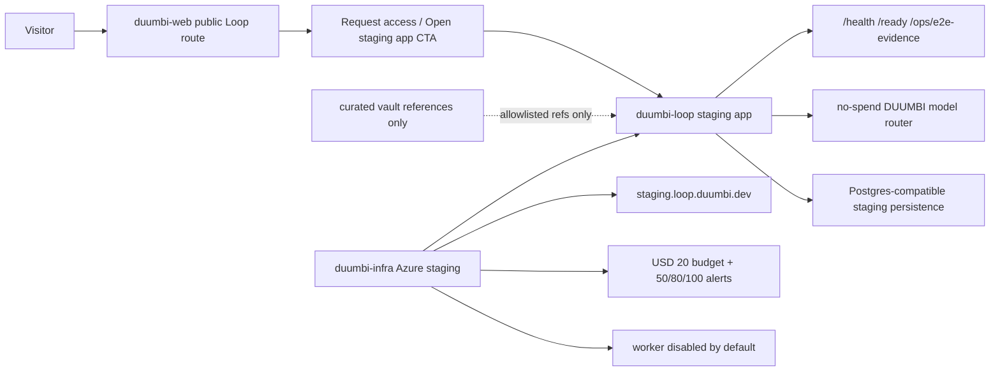

# DUUMBI-759: DUUMBI Loop Public Web And Azure Staging Slice - Technical Specification

Spec for #759.

Related to #738, #750, and #757.

This PR is specification-only and must leave #759 open. Do not use closing
references such as "closes", "fixes", or "resolves" for #759, #757, #750, or
#738.

## Implementation Objective

Prepare a Stage 10 implementation agent to build the next bounded DUUMBI Loop
slice:

```text
duumbi-web public Loop entry -> duumbi-loop staging deploy contract ->
duumbi-infra Azure staging boundary
```

The implementation must connect the public `duumbi.dev` experience to a
controlled Azure staging path while preserving the DUUMBI-native Loop direction
already established by #738, #750, and #757.

Invariants:

- `provider-duumbi` remains the primary path.
- GitHub/GitLab remain optional adapters, not prerequisites.
- DUUMBI-owned model labels are the user-facing contract.
- Hosted smoke must use deterministic no-spend/mock routing.
- No production auth, live Stripe products, live provider/model spend, real Git
  provider credentials, or Ralph cycles are allowed in this slice.
- This slice does not complete the full DUUMBI Loop product.

## Agent Audience

- Stage 10 implementation coordinator.
- `duumbi-web` public route implementer.
- `duumbi-infra` Azure/Pulumi implementer.
- `duumbi-loop` deploy-contract implementer.
- Security, privacy, billing, and cloud-cost reviewers.
- Future agents implementing production auth, billing, workers, or real
  adapters after this slice.

## Verified Current State

### `hgahub/duumbi`

`main` contains specs for #738, #750, and #757. This #759 spec PR should add
only `specs/DUUMBI-759/PRODUCT.md` and `specs/DUUMBI-759/TECHNICAL.md` unless
a documentation-only cross-reference is required.

### `hgahub/duumbi-loop`

PR #2 is merged at `7e639f427742a17e29e9f3b384058cfe223b52a3`.

Current relevant surfaces:

- `GET /health`
- `GET /ready`
- `GET /ops/e2e-evidence`
- local/test login routes,
- org dashboard/runs/providers/billing pages,
- native no-provider run creation,
- Stripe test webhook boundary,
- no-spend model route decisions,
- curated vault import allowlist/exclusion boundary,
- Postgres-backed startup via `DUUMBI_LOOP_DATABASE_URL`.

The current evidence file is
`docs/e2e/duumbi-757-local-postgres-e2e.md`.

### `hgahub/duumbi-web`

Current stack:

- Astro 6,
- Tailwind CSS 4,
- public marketing pages,
- docs subproject,
- global visual tokens in `src/styles/global.css`,
- default dark theme in `src/layouts/Layout.astro`.

Relevant visual tokens:

- light: parchment `#f5f2ea`, ink `#1a1a18`, blue ink `#1d4a8c`, rust
  `#8c3d1d`,
- dark: background `#0e1014`, surface `#15181d`, DUUMBI green `#86c06a`,
  hover/accent `#97cf7d`.

### `hgahub/duumbi-infra`

Current stack:

- TypeScript Pulumi,
- Azure Native,
- resource group patterns,
- Container Apps and managed environment patterns,
- DNS `duumbi.dev` CNAME and managed certificate pattern,
- Key Vault and Log Analytics patterns,
- storage account/file share pattern,
- tags via `lib/tags.ts`,
- subscription/project budget pattern with alert email configuration.

The current budget example has 80/100 percent alerts. This slice requires
50/80/100 percent alerts for the Loop staging budget.

### `hgahub/duumbi-vault`

Loop planning docs are reference input only. They must not become runtime
source of truth for hosted staging data, secrets, credentials, or arbitrary
knowledge imports.

## Cross-Repo Ownership And PR Order

| Order | Repo | Owns In This Slice | Must Not Own |
| ---: | --- | --- | --- |
| 1 | `hgahub/duumbi` | Spec artifacts for #759. | Implementation code, hosted resources, product runtime state. |
| 2 | `hgahub/duumbi-web` | Public Loop route, duumbi.dev visual integration, CTA, content tests. | Authenticated dashboard domain logic, billing calculations, Azure resources. |
| 3 | `hgahub/duumbi-loop` | Minimal staging deploy contract: env var docs, health/readiness/evidence shape, no-spend route compatibility, container build notes if missing. | Public marketing system, Azure stack definitions, production auth, live provider routing. |
| 4 | `hgahub/duumbi-infra` | Azure staging resources, budget, alerts, DNS, Container Apps, Key Vault references, Log Analytics, scale/teardown controls, hosted smoke outputs. | Product copy, Loop domain logic, billing calculations. |
| 5 | `hgahub/duumbi-registry` | Read-only unless a registry metadata boundary is explicitly required. | Loop app, public route, Azure staging ownership. |
| 6 | `hgahub/duumbi-vault` | Curated reference updates only if a reviewed allowlist doc is required. | Runtime source of truth, secrets, unreviewed imports. |

Recommended implementation order:

1. `duumbi-web`: public Loop route and route-level tests.
2. `duumbi-loop`: deploy contract gaps only, if needed after web route target is
   known.
3. `duumbi-infra`: Azure staging resources and smoke outputs after the app/web
   contract stabilizes.

Do not start hosted Azure work until the web route and Loop deploy contract are
clear and local gates are green.

## Architecture



## API And Deploy Contract Boundaries

### `duumbi-web` Public Route Contract

Implementation should add one public route, recommended:

```text
GET /loop
```

The route must be statically buildable by the existing Astro site and must not
require server-side secrets.

Required route content checks:

- first viewport contains "DUUMBI Loop",
- native workflow language appears,
- optional GitHub/GitLab adapter language appears,
- DUUMBI-owned model labels appear,
- copy does not claim full product completion,
- CTA target is configurable by environment.

Recommended environment variables:

```text
PUBLIC_DUUMBI_LOOP_CTA_URL
PUBLIC_DUUMBI_LOOP_CTA_LABEL
```

If no environment variable exists, route should default to a safe request-access
or placeholder path, not a production app claim.

### `duumbi-loop` Staging Deploy Contract

Implementation may need to document or add only the minimum contract required
for hosting:

```text
DUUMBI_LOOP_ADDR=0.0.0.0:8080
DUUMBI_LOOP_DATABASE_URL=<Postgres-compatible staging URL>
DUUMBI_LOOP_ENV=staging
DUUMBI_LOOP_MODEL_ROUTER=no_spend
DUUMBI_LOOP_ENABLE_WORKER=false
DUUMBI_LOOP_STRIPE_MODE=test
```

Required HTTP contract:

- `GET /health` returns successful liveness.
- `GET /ready` returns readiness plus persistence/auth/staging metadata.
- `GET /ops/e2e-evidence` reports no-spend guardrails.

If current `duumbi-loop` already satisfies a contract item, implementation
should not refactor it.

### `duumbi-infra` Azure Contract

Implementation should create a Loop staging Pulumi stack or module using
existing repo conventions.

Required resources:

- resource group: `rg-duumbi-loop-staging`,
- Container Apps environment: `cae-duumbi-loop-staging`,
- web/app Container App: `ca-duumbi-loop-web-staging`,
- worker Container App: `ca-duumbi-loop-worker-staging`,
- storage account: `stduumbiloopstaging`,
- Key Vault: `kv-duumbi-loop-staging`,
- Log Analytics workspace: `log-duumbi-loop-staging`,
- DNS/custom domain: `staging.loop.duumbi.dev`.

Required outputs:

- staging app URL,
- custom domain URL,
- resource group name,
- Container Apps environment name,
- app Container App name,
- worker Container App name,
- budget name,
- teardown/disable command or documented runbook reference,
- evidence summary path.

## Azure Cost And Scale Controls

Required budget:

- amount: USD 20/month,
- scope: subscription or resource-group scope as implementation proves safest,
- tag filter: `Project=Duumbi` and `Environment=LoopStaging` if subscription
  scoped,
- notifications: 50/80/100 percent,
- contact email comes from Pulumi config.

Required scale:

- staging app max replicas = 1,
- staging app min replicas = 0 where compatible with smoke requirements,
- worker max replicas = 1,
- worker min replicas = 0,
- worker disabled or not deployed unless explicit E2E queue work exists.

Required teardown/disable:

- `pulumi destroy` or an equivalent disable runbook must be documented.
- Hosted smoke evidence must state the post-smoke state: disabled, destroyed,
  or scaled to zero.
- No Azure smoke is accepted without budget evidence.

## Security And Privacy Requirements

- Do not store production secrets in source control.
- Use Key Vault/Pulumi secret references for app secrets.
- Use Stripe test mode only; no live Stripe keys.
- Use deterministic no-spend model router; no platform provider keys.
- GitHub/GitLab credentials are not required for smoke.
- DNS ownership and certificate validation must be explicit in infra evidence.
- Public route must not expose internal admin URLs, raw provider SKUs, secret
  names, database URLs, or staging credentials.
- `/ops/e2e-evidence` must not expose secrets or personal data.
- Hosted vault imports are limited to curated allowlisted refs and remain out of
  scope unless a later implementation explicitly needs them.
- Logs must avoid request bodies that may contain source content, prompts,
  secrets, or personal data.

## Billing And Cloud-Cost Constraints

- Stripe test mode only.
- No live checkout, live invoices, or live customer portal.
- Entitlement mirror may be shown as test/staging only.
- Hosted smoke must record live Stripe calls = 0.
- Cloud budget is USD 20/month for non-prod Loop staging.
- Cloud resources must be tagged for cost attribution.
- Worker must not run continuously.
- No live provider/model spend or external LLM calls.

## BDD-To-Test Mapping

| BDD Scenario | Test Or Evidence | Repo |
| --- | --- | --- |
| Public Loop page is reachable and branded | Astro build plus route/content test or snapshot asserting first-viewport "DUUMBI Loop" and token-backed classes/content. | `duumbi-web` |
| Public copy does not overclaim completion | Content test that rejects prohibited claims such as full launch, production auth complete, live billing complete, or Git adapters required. | `duumbi-web` |
| Native workflow is primary | Content test asserting intent/intake/spec/review language and optional adapter language. | `duumbi-web` |
| DUUMBI-owned model labels are the public contract | Content test asserting Fast/Balanced/Deep Research/Strict Review/Private-BYOK labels and absence of raw provider SKU choices. | `duumbi-web` |
| Public CTA reaches the staging boundary safely | Configured CTA test; staging smoke opens CTA target and verifies it does not start a spendful run. | `duumbi-web`, `duumbi-loop` |
| Staging app exposes health and evidence | HTTP smoke for `/health`, `/ready`, `/ops/e2e-evidence`; evidence values assert no-spend guardrails. | `duumbi-loop`, `duumbi-infra` |
| Azure staging resources follow approved names | Pulumi preview/test or static TypeScript assertions for approved names and tags. | `duumbi-infra` |
| Budget controls are visible before hosted smoke | Pulumi preview output and evidence showing USD 20 budget and 50/80/100 alert thresholds. | `duumbi-infra` |
| Worker remains disabled by default | Pulumi preview/smoke assertion shows worker min replicas 0 and disabled/no active queue execution. | `duumbi-infra` |
| Hosted smoke has no live spend | Evidence file records external LLM calls = 0, Git provider credentials = 0, live provider/model spend = 0, live Stripe calls = 0, Ralph cycles = 0. | `duumbi-loop`, `duumbi-infra` |

## Verification Plan

### `duumbi-web`

Expected local checks:

```text
npm install
npm run build
```

Add focused tests or scripts only if the repo already supports them or the
implementation can keep them low-cost. At minimum, implementation must provide
build evidence and a content verification command or script.

### `duumbi-loop`

Expected local checks if deploy-contract code changes are made:

```text
cargo fmt --check
cargo clippy --all-targets -- -D warnings
cargo test
```

If Postgres-specific behavior changes:

```text
DUUMBI_LOOP_RUN_POSTGRES_TESTS=1 \
DUUMBI_LOOP_DATABASE_URL='<redacted local Postgres URL>' \
cargo test
```

### `duumbi-infra`

Expected local checks:

```text
npm install
npx tsc --noEmit
pulumi preview
```

`pulumi preview` requires configured Azure/Pulumi credentials and budget/DNS
ownership. If those are unavailable, implementation must stop with findings
rather than guessing.

## Live E2E Plan

### Phase 1: Local Contract Smoke

Purpose: prove the web route and Loop app contract before cloud resources.

Steps:

1. Build `duumbi-web` with the Loop CTA configured to a local or staging-safe
   target.
2. Start `duumbi-loop` locally with no-spend model routing and Postgres if
   available.
3. Verify:
   - public route content,
   - CTA target,
   - `GET /health`,
   - `GET /ready`,
   - `GET /ops/e2e-evidence`.

Evidence must record:

- external LLM calls = 0,
- Git provider credentials = 0,
- live provider/model spend = 0,
- live Stripe calls = 0,
- hosted cloud resources = 0 for local phase,
- Ralph cycles = 0.

### Phase 2: Infra Preview Gate

Purpose: prove Azure resources are planned correctly before creation.

Prerequisites:

- Azure subscription access,
- Pulumi stack/config access,
- DNS zone ownership for `duumbi.dev`,
- alert email configured,
- Key Vault/Pulumi secret handling configured.

Steps:

1. Run TypeScript check.
2. Run `pulumi preview`.
3. Confirm approved resource names only.
4. Confirm budget and alert thresholds.
5. Confirm worker disabled/scale-to-zero/max replica settings.

If any prerequisite is missing, stop with findings.

### Phase 3: Hosted Azure Staging Smoke

Purpose: prove minimal hosted route under the USD 20 budget.

Steps:

1. Deploy staging resources only after Phase 2 passes.
2. Open `https://staging.loop.duumbi.dev`.
3. Verify `/health`, `/ready`, and `/ops/e2e-evidence`.
4. Verify public web CTA reaches the expected staging-safe target.
5. Verify no live model spend, no live Stripe calls, no Git provider
   credentials, and no worker execution outside explicit E2E.
6. Capture budget, tags, scale, worker, and teardown/disable evidence.
7. Destroy, disable, or scale to zero according to the runbook.

## Ralph Cycle Resource Policy

- No Ralph cycles in spec PRs.
- Default external LLM call cap: 0.
- Default live provider/model spend cap: 0.
- Default live Stripe call cap: 0.
- Default Git provider credential use: 0.
- Hosted Azure work requires explicit Stage 10 authorization, approved resource
  names, budget cap, alert policy, and teardown/disable evidence.
- Worker may run only during an explicit E2E queue test and must return to
  disabled or scale-to-zero after evidence capture.
- If a resource begins accruing unexpected cost, stop work, disable or destroy
  the resource, and report findings.

## Stage 10 Implementation Prompt

```text
Run DUUMBI Stage 10 implementation for #759 using
specs/DUUMBI-759/PRODUCT.md and specs/DUUMBI-759/TECHNICAL.md.

Target issue: https://github.com/hgahub/duumbi/issues/759

Parent context:
- #738 delivered the provider-core/native CLI foundation in hgahub/duumbi.
- #750 and hgahub/duumbi-loop PR #1 delivered the first local/no-cost web+infra slice.
- #757 and hgahub/duumbi-loop PR #2 delivered the first production-integration duumbi-loop slice.
- The full DUUMBI Loop product is not complete.

Goal:
Implement the next bounded DUUMBI Loop public web + Azure staging slice:
- hgahub/duumbi-web public Loop route using duumbi.dev visual language,
- minimal hgahub/duumbi-loop staging deploy contract only if required,
- hgahub/duumbi-infra Azure staging resources after local/web/app gates are green.

Recommended PR order:
1. hgahub/duumbi-web: add the public Loop route, safe CTA, and route/content/build verification.
2. hgahub/duumbi-loop: fill only staging deploy-contract gaps if the current health/readiness/evidence/env behavior is insufficient.
3. hgahub/duumbi-infra: add approved Azure staging resources, budget alerts, scale-to-zero/max-replica controls, disabled worker default, DNS/cert boundary, and hosted smoke evidence.

Constraints:
- GitHub/GitLab remain optional adapters.
- provider-duumbi remains the primary path.
- DUUMBI-owned model labels remain the user-facing contract.
- Do not claim the full DUUMBI Loop product is complete.
- No production auth.
- No live Stripe products or live Stripe calls.
- No live provider/model spend or external LLM calls.
- No GitHub/GitLab credentials.
- No Ralph cycles.
- Do not start hosted Azure work until duumbi-web and duumbi-loop local gates are green.
- Azure staging must use the approved resource names and USD 20/month budget with 50/80/100 alerts.
- Worker must be disabled or scaled to zero outside explicit E2E queue work.
- Use non-closing references such as "Related to #759".
- Greptile is reserved for final implementation PR review, not spec PRs.

Required verification:
- duumbi-web build and public route/content checks.
- duumbi-loop cargo checks if any deploy-contract code changes are made.
- duumbi-infra TypeScript check and Pulumi preview.
- Hosted smoke only after cloud budget/resource/DNS/secret gates are met.
- Evidence file recording external LLM calls = 0, Git provider credentials = 0, live provider/model spend = 0, live Stripe calls = 0, worker execution outside explicit E2E = 0, and Ralph cycles = 0.

Stop with findings if auth, billing, database, cloud budget, Azure ownership,
domain/DNS, secrets, model routing, or cross-repo write access creates a blocker.
```

## Codex Self-Review

### Product Spec Review

Result: pass.

Checks:

- English product spec exists at `specs/DUUMBI-759/PRODUCT.md`.
- BDD scenarios are present.
- Non-goals explicitly prevent full product completion claims.
- Scope is bounded to public web entry, Azure staging, and minimal deploy
  contract.
- Product guardrails preserve provider-duumbi, optional Git adapters, and
  DUUMBI-owned model labels.

### Technical Spec Review

Result: pass.

Checks:

- BDD-to-test mapping is present.
- Cross-repo ownership and PR order are explicit.
- API/deploy contract boundaries are explicit.
- Azure resource names, budget cap, alerts, scale policy, worker policy, and
  teardown/disable expectations are explicit.
- Security/privacy, billing/cloud-cost constraints, live E2E plan, Ralph Cycle
  resource policy, and Stage 10 prompt are present.
- No implementation code is introduced by this spec.

## Stage 9 Technical Gate Decision

Gate decision: pass.

Reasoning:

- The build slice is bounded and sequenced across `duumbi-web`, `duumbi-loop`,
  and `duumbi-infra`.
- Cloud work is gated behind local/web/app checks, Azure credentials, DNS
  ownership, Pulumi preview, budget evidence, and teardown/disable policy.
- No unresolved blocker remains for spec drafting.
