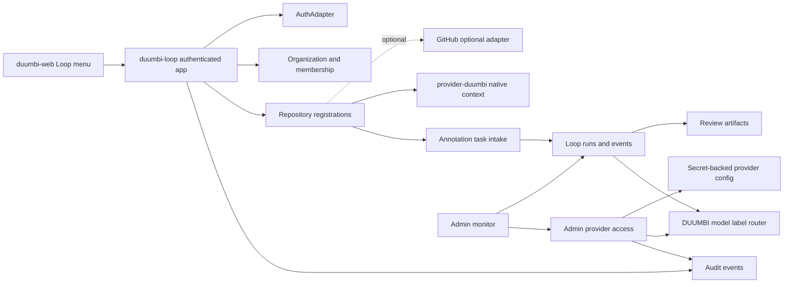

# DUUMBI-761: Authenticated Repo-To-Run Journey And Admin Provider Access - Technical Specification

Spec for #761.

Related to #738, #750, #757, and #759.

This PR is specification-only and must leave #761 open. Do not use closing
references such as "closes", "fixes", or "resolves" for #761, #759, #757,
#750, or #738.

## Implementation Objective

Prepare a Stage 10 implementation agent to build the next bounded DUUMBI Loop
slice:

```text
duumbi-web Loop navigation -> authenticated duumbi-loop app ->
repository registration -> annotation task intake -> run tracking ->
admin provider-access controls
```

The implementation must let an authenticated user create and track a
repository-linked DUUMBI Loop task while letting administrators configure and
audit provider access that customers use indirectly through DUUMBI-owned model
labels.

Invariants:

- `provider-duumbi` remains the primary native path.
- GitHub/GitLab remain optional adapters, not prerequisites.
- DUUMBI-owned model labels are the customer-facing contract.
- Raw provider/model SKUs are admin/audit metadata only.
- Provider credentials are admin-only, secret-backed, write-only after entry,
  and audited.
- Staging must use deterministic no-spend/mock routing unless explicit
  production-spend approval is recorded in a later slice.
- This slice does not complete the full DUUMBI Loop product.

## Agent Audience

- Stage 10 implementation coordinator.
- `duumbi-web` navigation implementer.
- `duumbi-loop` app/API/domain implementer.
- GitHub adapter boundary implementer.
- `duumbi-infra` secret/config implementer if hosted staging needs new
  configuration.
- Security, privacy, billing, and audit reviewers.
- Future agents implementing production auth, live billing, real provider spend,
  or full GitHub/GitLab app integrations.

## Verified Current State

### `hgahub/duumbi`

#738, #750, #757, and #759 are closed as completed bounded slices. This spec PR
should add only:

- `specs/DUUMBI-761/PRODUCT.md`
- `specs/DUUMBI-761/TECHNICAL.md`

unless a documentation-only cross-reference is required.

### `hgahub/duumbi-loop`

Current relevant surfaces from the #750, #757, and #759 implementation line:

- local/test AuthAdapter and secure session cookie,
- organization dashboard,
- run list and run detail pages,
- providers page,
- billing page,
- account lifecycle API shell,
- Postgres startup via `DUUMBI_LOOP_DATABASE_URL`,
- Stripe test entitlement mirror and credit ledger,
- deterministic no-spend model router,
- native no-provider run creation,
- curated vault import boundary,
- staging `/health`, `/ready`, and `/ops/e2e-evidence`.

Current gaps for #761:

- no complete repository registration UI/API for real or stubbed GitHub
  repository metadata,
- no repository-linked annotation task intake,
- no run events/step timeline UI suitable for process tracking,
- no admin organization run monitor,
- no admin provider-access configuration surface,
- no provider secret write-only/audit model,
- no customer/admin separation for route decision detail.

### `hgahub/duumbi-web`

#759 added the public Loop route. This slice should add or adjust navigation so
the Loop menu/link points to the authenticated Loop entry. The public site must
not own authenticated domain logic or secrets.

### `hgahub/duumbi-infra`

#759 delivered the staging boundary, custom domain, Key Vault secret boundary,
GHCR guard, and hosted smoke evidence. This slice may need new secret names or
configuration placeholders for provider access. It must not enable live
provider/model spend by default.

### `hgahub/duumbi-registry`

Read-only unless implementation discovers that repository or model-label
metadata needs a formal registry boundary. Do not make registry the Loop tenant,
billing, or provider-secret source of truth.

### `hgahub/duumbi-vault`

Reference material only. No arbitrary vault import expansion in this slice.

## Cross-Repo Ownership And PR Order

| Order | Repo | Owns In This Slice | Must Not Own |
| ---: | --- | --- | --- |
| 1 | `hgahub/duumbi` | Spec artifacts for #761. | Runtime app, secrets, Azure resources. |
| 2 | `hgahub/duumbi-web` | Loop navigation/menu entry and configured app handoff. | Authenticated app logic, repository data, provider settings. |
| 3 | `hgahub/duumbi-loop` | Authenticated repository registration, annotation task intake, run tracking UI/API, admin monitor, provider-access model, audit, tests. | Public marketing visual system, Azure resource definitions, raw provider execution. |
| 4 | `hgahub/duumbi-infra` | Secret/config names and staging app settings only if needed after app contract stabilizes. | Product logic, provider routing policy, customer UI. |
| 5 | `hgahub/duumbi` | Core contract updates only if `provider-duumbi` cannot represent repository-linked run context. | Loop tenant/app ownership. |
| 6 | `hgahub/duumbi-registry` | Read-only unless explicit metadata API boundary is required. | Tenant state, provider secrets. |
| 7 | `hgahub/duumbi-vault` | Curated docs only if needed. | Runtime source of truth or secrets. |

Recommended implementation order:

1. `duumbi-web`: add or adjust Loop menu/link and route verification.
2. `duumbi-loop`: implement repository registration, annotation intake, run
   tracking, admin provider-access controls, and tests.
3. `duumbi-infra`: add provider-secret config placeholders only after
   `duumbi-loop` contract names are final.
4. `duumbi` core only if a hard provider-duumbi contract gap is found.

Do not start live provider/model spend or production auth work in this slice.

## Architecture



## Auth And Authorization

`duumbi-loop` keeps ownership of the AuthAdapter boundary for this slice.
Production `auth.duumbi.dev` remains future-compatible but not required.

Required checks:

- unauthenticated users cannot access organization data,
- membership is checked on every org-scoped API and page,
- repository registration requires Owner/Admin/Developer or a narrower
  capability,
- task creation requires `can_start_run`,
- admin monitor requires Owner/Admin,
- provider-access configuration requires Owner or platform admin role,
- billing/credit details remain scoped to the organization,
- session and account lifecycle behavior from #750/#757 must keep passing.

Recommended capability names:

- `repo:read`
- `repo:write`
- `run:create`
- `run:read`
- `admin:runs`
- `admin:provider_access`
- `audit:read`

## Data Model Boundaries

`duumbi-loop` owns Postgres-compatible migrations. Prefer additive migrations
after the #757 schema.

### Repository Registration

Extend or formalize `repository_registrations`:

- `id`
- `organization_id`
- `provider_connection_id` nullable
- `adapter_kind`: `native`, `github`, `gitlab`
- `display_name`
- `repository_url` nullable
- `provider_owner` nullable
- `provider_repo` nullable
- `default_branch` nullable
- `selected_ref` nullable
- `native_workspace_ref` nullable
- `status`: `enabled_indexed`, `disabled`, `disabled_by_plan_limit`,
  `disabled_by_provider_revoked`, `pending_validation`
- `created_by_user_id`
- `created_at`
- `updated_at`

Repository rows must not store access tokens.

### Provider Connections

Extend or formalize `provider_connections`:

- `id`
- `organization_id`
- `adapter_kind`: `github`, `gitlab`, `native`
- `status`: `not_configured`, `test_configured`, `enabled`, `disabled`,
  `revoked`, `blocked`
- `credential_ref` nullable secret reference
- `external_installation_id` nullable
- `scopes_summary` nullable
- `last_validated_at` nullable
- `created_by_user_id`
- `updated_by_user_id`
- `created_at`
- `updated_at`

The `credential_ref` points to a secret-backed reference. It is never displayed
after entry and never returned to customer-facing APIs.

### Annotation Tasks

Add `loop_task_requests` or equivalent:

- `id`
- `organization_id`
- `actor_user_id`
- `repository_registration_id`
- `provider_connection_id` nullable
- `annotation_text`
- `normalized_instruction`
- `selected_ref` nullable
- `workflow_kind`
- `model_label`
- `estimated_credits`
- `preflight_status`
- `created_run_id` nullable
- `created_at`

Annotation parsing must be deterministic for tests. It must reject empty,
malformed, or unsupported annotations before run creation.

### Run Events

Ensure `loop_run_events` or equivalent supports:

- `id`
- `organization_id`
- `run_id`
- `event_kind`
- `state_before` nullable
- `state_after` nullable
- `message`
- `actor_user_id` nullable
- `created_at`

Run tracking UI should consume event rows rather than inferring all process
state from a single run row.

### Provider Access And Routing

Add `provider_access_configs` or equivalent:

- `id`
- `organization_id` nullable for platform default
- `label`
- `route_mode`: `no_spend`, `platform_key`, `byok`, `disabled`
- `provider_kind` nullable
- `raw_provider_sku` nullable, admin/audit only
- `credential_ref` nullable
- `status`
- `live_spend_allowed`
- `last_validated_at` nullable
- `created_by_user_id`
- `updated_by_user_id`
- `created_at`
- `updated_at`

Existing `model_route_decisions` should reference the selected label and route
mode. Customer-facing APIs return label and route mode only. Admin APIs may
return raw provider/model SKU metadata only for authorized admin/audit users and
must redact credential references.

### Audit Events

Audit events must cover:

- login/session lifecycle where already supported,
- repository registration created/disabled/validated,
- provider connection created/disabled/revoked,
- annotation task accepted/rejected,
- run created/state changed,
- provider access created/updated/disabled,
- route policy changed,
- credit preflight denied.

Minimum fields:

- actor user ID,
- organization ID,
- action,
- target type,
- target ID,
- correlation ID,
- timestamp,
- redacted metadata.

## API Boundaries

Recommended `duumbi-loop` APIs:

```text
GET  /api/orgs/{org_id}/repositories
POST /api/orgs/{org_id}/repositories
GET  /api/orgs/{org_id}/repositories/{repository_id}
PATCH /api/orgs/{org_id}/repositories/{repository_id}

GET  /api/orgs/{org_id}/provider-connections
POST /api/orgs/{org_id}/provider-connections/github/test
PATCH /api/orgs/{org_id}/provider-connections/{connection_id}

POST /api/orgs/{org_id}/task-requests
GET  /api/orgs/{org_id}/task-requests/{task_request_id}

GET  /api/orgs/{org_id}/runs
GET  /api/orgs/{org_id}/runs/{run_id}
GET  /api/orgs/{org_id}/runs/{run_id}/events
GET  /api/orgs/{org_id}/runs/{run_id}/artifacts

GET  /api/admin/orgs/{org_id}/runs
GET  /api/admin/orgs/{org_id}/provider-access
POST /api/admin/orgs/{org_id}/provider-access
PATCH /api/admin/orgs/{org_id}/provider-access/{config_id}
GET  /api/admin/orgs/{org_id}/audit-events
```

Server-rendered pages may be added or updated:

```text
GET /o/{org}/repositories
GET /o/{org}/repositories/new
GET /o/{org}/tasks/new
GET /o/{org}/runs
GET /o/{org}/runs/{run_id}
GET /o/{org}/admin/runs
GET /o/{org}/admin/provider-access
GET /o/{org}/admin/audit
```

API responses must not expose secrets. Customer-facing responses must not expose
raw provider/model SKUs.

## GitHub Adapter Boundary

This slice may implement GitHub as a test/stub adapter first, unless
maintainers explicitly approve a real GitHub App or OAuth flow before Stage 10.

Required either way:

- GitHub is optional.
- Native workspace registration remains available.
- Missing/revoked GitHub credentials do not break native runs.
- Repository URL/owner/name parsing is validated.
- Credentials are not stored in repository rows.
- Provider connection state is explicit and auditable.

If a real GitHub integration is approved:

- prefer GitHub App installation tokens over user PATs,
- store only secret references and external installation metadata,
- request minimum read scopes required for repository metadata and annotation
  context,
- avoid persisting raw source content unless explicitly accepted by the user and
  bounded by retention policy,
- record permission and installation changes in audit events.

## Annotation Intake

The accepted annotation grammar must be simple and deterministic.

Recommended minimum grammar:

```text
@duumbi-loop <instruction>
```

Optional fields can be represented through form controls rather than embedded
syntax:

- repository ID,
- selected ref,
- workflow kind,
- model label,
- knowledge/context toggles.

Preflight order:

1. authenticate user,
2. authorize organization membership and run capability,
3. validate repository registration and provider status,
4. parse annotation,
5. validate model label availability,
6. estimate credits,
7. verify billing/entitlement and parallel run limits,
8. create task request and run in one durable transaction,
9. write audit event and run event.

If any preflight fails, do not create a run and do not debit credits.

## Billing And Entitlement Constraints

Use the existing Stripe test entitlement mirror and credit ledger.

Required checks before run creation:

- billing status is active or otherwise allowed for test/staging,
- repository limit has not been exceeded,
- parallel run limit has not been exceeded,
- selected model label is allowed,
- estimate does not exceed `max_credits_per_run`,
- available credit balance can cover the estimate,
- over-cap requests fail before task/run write.

No live Stripe calls are allowed in this slice. Stripe test webhook behavior
from #750/#757 must continue to pass.

## Security And Privacy Requirements

- Provider credentials are write-only after entry.
- Secret material is stored only through approved secret-backed references.
- Do not log provider tokens, database URLs, annotation bodies that may contain
  secrets, raw source dumps, or personal data.
- Customer-facing APIs and pages expose DUUMBI-owned model labels only.
- Admin APIs require stronger authorization and redact secret references.
- Audit events must use redacted metadata.
- Repository context stored in DB must be bounded metadata, not unbounded source
  content.
- Artifact references must validate path traversal and ownership.
- CSRF protection or same-site form protections must exist for mutating
  server-rendered routes.
- Session cookies remain HttpOnly, Secure, SameSite, and scoped appropriately.
- Hosted staging keeps no-spend model routing unless explicitly approved
  otherwise in a later issue.

## BDD-To-Test Mapping

| Product Scenario | Required Tests |
| --- | --- |
| Public navigation reaches Loop | `duumbi-web` route/nav build test; CTA target verifier. |
| Authenticated app entry protects organization data | `duumbi-loop` integration tests for unauthenticated dashboard/repo/run/admin routes. |
| User signs in and sees organization dashboard | login to dashboard integration test with repo/model/credit summary assertions. |
| GitHub repository registration is optional | repository page/API test showing GitHub option and native option. |
| Repository limit blocks registration before write | unit/integration test asserting no repository row after limit failure. |
| Provider revoked repository is not selectable | repository/task form test and API validation test. |
| User creates annotation task for registered repository | integration test creating repo, posting annotation, asserting task/run/audit rows. |
| Invalid annotation is rejected | parser unit test and API test with no run/credit write. |
| Credit preflight blocks over-cap run | billing preflight test asserting fail-before-write. |
| User tracks workflow progress | run detail page/API test showing state, events, artifacts, repo, model label. |
| Review artifact is visible when complete | review artifact rendering test with path/ownership validation. |
| Admin sees organization run monitor | admin page/API authorization and content tests. |
| Admin configures provider access status | provider access create/update tests with write-only secret behavior. |
| Customer cannot see raw provider SKUs | customer API/page snapshot or assertion tests. |
| Admin audit can inspect route decision metadata | admin route-decision/audit tests with role checks and redaction. |
| Staging E2E uses no-spend routing | local/staging E2E evidence with external calls/spend/live Stripe = 0. |
| GitHub adapter failure does not break native path | integration test with revoked GitHub connection and successful native run. |
| Admin provider access does not start spend by default | provider config test asserting no live call and `live_spend_allowed=false`. |
| Audit trail covers sensitive actions | audit tests for repo, task, provider-access, route-policy changes. |

## Local Verification Requirements

`duumbi-web` PR:

- install/build command used by existing repo,
- route/nav verifier,
- no secret/env requirement for static build.

`duumbi-loop` PR:

- `cargo fmt --check`,
- `cargo clippy --all-targets -- -D warnings`,
- `cargo test`,
- Postgres migration/integration tests with `DUUMBI_LOOP_DATABASE_URL`,
- auth/session regression tests,
- repository registration tests,
- annotation parser tests,
- run tracking tests,
- admin provider-access tests,
- audit redaction tests,
- no-spend route tests.

`duumbi-infra` PR, only if needed:

- TypeScript check,
- Pulumi preview,
- no secret values in outputs,
- no provider/model spend enabled.

## Live E2E Plan

Default E2E is local or staging no-spend:

1. Open `duumbi-web` Loop menu/link.
2. Reach `duumbi-loop` staging app.
3. Sign in through local/test AuthAdapter.
4. Create a native workspace repository and a test/stub GitHub repository.
5. Submit `@duumbi-loop draft a spec for this repo change`.
6. Verify task request and run creation.
7. Verify run state, events, artifacts, review summary, model label, and credit
   estimate in the UI.
8. Open admin monitor and verify the run, route decision, provider status, and
   audit events.
9. Configure provider access in no-spend/test mode.
10. Verify no customer-facing surface exposes raw provider/model SKUs.
11. Record evidence:
    - external LLM calls = 0,
    - live provider/model spend = 0,
    - live Stripe calls = 0,
    - Git provider credentials = 0 or explicitly test-scoped,
    - worker execution outside explicit E2E = 0,
    - Ralph cycles = 0.

Hosted E2E must stop with findings unless:

- staging app is healthy and ready,
- Postgres-compatible persistence is configured,
- provider credentials are test-scoped or explicitly disabled,
- no-spend router is active,
- budget and worker guardrails from #759 remain in effect.

## Ralph Cycle Resource Policy

Ralph cycles are not allowed by default for this slice.

Stage 10 may request a Ralph cycle only if all are true:

- the blocker cannot be resolved from repo context, specs, or deterministic
  local tests,
- the request is scoped to a single question,
- estimated external cost is below USD 2,
- live provider/model spend is not triggered,
- no production secrets are exposed,
- the issue comment records purpose, expected cost, inputs, and result.

If these conditions are not met, stop with findings instead of starting a Ralph
cycle.

## Stage 10 Implementation Prompt

```text
Run DUUMBI Stage 10 implementation for #761 using
specs/DUUMBI-761/PRODUCT.md and specs/DUUMBI-761/TECHNICAL.md.

Target issue: https://github.com/hgahub/duumbi/issues/761

Parent context:
- #738 delivered the provider-core/native CLI foundation.
- #750 delivered the first local/no-cost duumbi-loop web+infra slice.
- #757 delivered the first production-integration duumbi-loop slice.
- #759 delivered the public duumbi.dev Loop entry route and Azure staging
  boundary.
- #738, #750, #757, and #759 are closed as completed bounded slices.
- The full DUUMBI Loop product is not complete.

Goal:
Implement the next bounded authenticated DUUMBI Loop repo-to-run journey:
- duumbi-web Loop menu/link to the DUUMBI Loop app,
- authenticated duumbi-loop app entry,
- organization-scoped repository registration with GitHub as an optional
  adapter and native workspace registration still available,
- annotation-based task intake for a selected repository,
- user-facing run tracking with state, step events, artifacts, and review
  result,
- admin run monitor,
- admin provider-access configuration used indirectly by customers through
  DUUMBI-owned model labels,
- audit evidence for repository, task, route, and provider-access changes.

Recommended PR order:
1. hgahub/duumbi-web: Loop menu/link and configured app handoff.
2. hgahub/duumbi-loop: repository registration, annotation intake, run
   tracking, admin monitor, provider-access model, audit, tests, and local
   Postgres evidence.
3. hgahub/duumbi-infra: provider-secret config placeholders only if required
   by the duumbi-loop contract; no live spend enablement.
4. hgahub/duumbi only if provider-duumbi cannot represent repository-linked
   run context.

Constraints:
- GitHub/GitLab remain optional adapters, not prerequisites.
- provider-duumbi remains the primary path.
- DUUMBI-owned model labels remain the user-facing contract.
- Customers must not see raw provider/model SKUs.
- Provider credentials must be admin-only, secret-backed, write-only after
  entry, and audited.
- No production auth.
- No live Stripe products or live Stripe calls.
- No live provider/model spend or external LLM calls.
- No GitHub/GitLab production credentials unless explicitly approved; test/stub
  adapter is acceptable for the first implementation PR.
- No Ralph cycles unless explicitly authorized under the resource policy.
- Use non-closing references such as "Related to #761".
- Greptile is reserved for the final implementation PR review.

Required verification:
- duumbi-web build and Loop navigation/link verifier,
- duumbi-loop cargo fmt, clippy, and tests,
- Postgres migration/integration tests,
- auth/session authorization tests,
- repository registration and entitlement limit tests,
- annotation parser and task creation tests,
- over-cap blocked-before-write tests,
- run tracking and review artifact tests,
- admin provider-access and audit redaction tests,
- no-spend model-router tests,
- local or staging E2E evidence recording external LLM calls = 0, live
  provider/model spend = 0, live Stripe calls = 0, Git provider credentials = 0
  or explicitly test-scoped, worker execution outside explicit E2E = 0, and
  Ralph cycles = 0.

Stop with findings if auth ownership, GitHub credential ownership, provider
secret handling, billing, auditability, security/privacy, model routing, cloud
budget, or cross-repo write access creates a blocker.
```

## Stage 7 And Stage 9 Self-Review Checklist

Stage 7 product gate passes only if:

- product spec is in English,
- BDD scenarios cover navigation, auth, repository registration, annotation
  intake, run tracking, admin monitor, provider access, model-label hiding, and
  no-spend staging,
- non-goals are explicit,
- the full DUUMBI Loop product is not claimed complete.

Stage 9 technical gate passes only if:

- every BDD scenario maps to tests,
- cross-repo ownership and PR order are explicit,
- API/data model boundaries are explicit,
- auth/session, GitHub adapter, provider-secret, billing, audit, and security
  boundaries are explicit,
- live E2E and Ralph Cycle policies are explicit,
- Stage 10 prompt is present.
