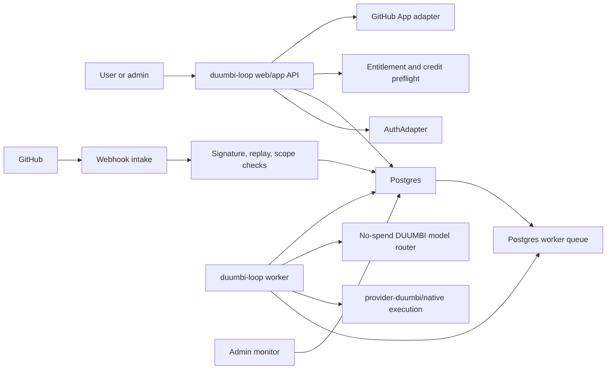

# DUUMBI-763 Technical Spec: GitHub Adapter And Async Worker Slice

Related to #763

Workflow note: this is a spec-only artifact. Any PR containing this document must
use non-closing issue references and must leave #763 open for Stage 10
implementation.

## Purpose

Prepare Stage 10 implementation for the next bounded DUUMBI Loop slice:

- real optional GitHub App adapter,
- secure webhook and repository registration boundary,
- controlled Postgres-backed async worker execution,
- user/admin tracking from queued to terminal states,
- no-spend hosted smoke path.

This is not full DUUMBI Loop completion.

## Implementation Principles

- `provider-duumbi` remains the primary native path.
- GitHub becomes a real optional adapter, not a prerequisite.
- GitLab remains optional and out of scope except for preserving interface
  boundaries.
- DUUMBI-owned model labels remain the customer-facing contract.
- Raw provider/model SKUs must not appear in customer surfaces.
- Local and CI verification must not require live GitHub credentials.
- Hosted staging may use a non-production GitHub App only when secrets and an
  explicit E2E approval are present.
- No live provider/model spend, live Stripe products, production auth, or Ralph
  cycles are allowed.

## Cross-Repo Ownership And PR Order

1. `hgahub/duumbi`: spec artifacts only for this PR.
2. `hgahub/duumbi-loop`: primary implementation repo for GitHub App adapter,
   webhook intake, repository sync, Postgres migrations, queue, worker, run
   events, admin monitor, tests, and evidence.
3. `hgahub/duumbi-infra`: only if staging app settings, Key Vault secret names,
   worker enablement flags, or hosted smoke wiring are required after
   `duumbi-loop` local gates are green. Do not run `pulumi up` without explicit
   approval.
4. `hgahub/duumbi-web`: only if the public Loop entry needs copy or navigation
   adjustment for the GitHub adapter handoff. No web change is required by
   default.
5. `hgahub/duumbi`: core code only if a provider-duumbi or loop-native contract
   gap blocks the approved slice.
6. `hgahub/duumbi-registry`: read-only unless a registry metadata API boundary
   is explicitly required.
7. `hgahub/duumbi-vault`: curated references only; not runtime source of truth.

## Current System Boundary

The #761 implementation already provides:

- local/test auth and organization session behavior,
- provider connection and repository registration domain models,
- task request, run event, artifact, provider access config, and audit surfaces,
- Postgres persistence for repository/task/run/admin objects,
- annotation task intake through browser/API forms,
- admin monitor and provider access configuration,
- GitHub test/stub provider adapter boundary,
- worker disabled guard in deploy contract.

This slice must extend those boundaries without replacing them.

## Architecture

## GitHub App Decision

Use GitHub App installation access for this slice.

Rationale:

- GitHub App installation tokens are repository-scoped and short-lived.
- Installation permissions can be validated per repository.
- Webhooks naturally bind to app installation events and repository events.
- User OAuth should not be required for repository automation in the first real
  adapter slice.
- Personal access tokens are not allowed for this adapter path.

Ownership:

- `duumbi-loop` owns the GitHub adapter interface and implementation.
- `hgahub` owns the non-production/staging GitHub App configuration unless a
  later issue creates a dedicated platform ownership model.
- The adapter must support fake/local fixtures for tests.

Minimum app permissions:

- Repository metadata read.
- Contents read only where source context is required.
- Issues and pull requests read where annotation intake is supported.
- Webhook events for issue comments, pull request review comments, pull request
  comments, push, installation, and repository events as needed by the approved
  implementation.

No repository write permission is required in this slice unless Stage 10 finds a
blocking need and records a separate decision.

## API Boundaries

### Provider Connection

Existing provider connection APIs may be extended or new endpoints may be added:

- `GET /api/orgs/{org_id}/provider-connections`
- `POST /api/orgs/{org_id}/provider-connections/github/app/start`
- `GET /api/orgs/{org_id}/provider-connections/github/app/callback`
- `POST /api/orgs/{org_id}/provider-connections/{connection_id}/sync`
- `DELETE /api/orgs/{org_id}/provider-connections/{connection_id}`

The exact callback shape depends on the GitHub App flow selected by the
implementation. The start endpoint must persist a one-time state value bound to
the initiating admin session, user id, organization id, redirect target, and
expiry. The callback must verify and consume that state before creating or
updating a provider connection. Missing, expired, reused, or cross-organization
state values must fail closed before installation data is stored. The API must
never return raw tokens or private keys.

### Repository Registration

- `GET /api/orgs/{org_id}/repositories`
- `POST /api/orgs/{org_id}/repositories`
- `POST /api/orgs/{org_id}/repositories/{repository_id}/sync`
- `PATCH /api/orgs/{org_id}/repositories/{repository_id}`

Repository registration must validate:

- organization membership and role,
- provider connection status,
- installation repository access,
- plan repository limit,
- selected ref/default branch policy.

### Webhook Intake

- `POST /api/webhooks/github`

The webhook endpoint must:

- verify GitHub HMAC signature,
- reject missing or invalid signatures,
- require configured webhook secret,
- reject events outside accepted event/action list,
- enforce installation/repository/org mapping,
- enforce repository enabled status,
- deduplicate by delivery id,
- record sanitized audit/intake events,
- avoid writing queued work until auth, provider, billing, model label, and
  repository gates pass.

### Worker Control

Worker execution may be provided by a separate binary, subcommand, or process
mode in `duumbi-loop`. It must support:

- disabled-by-default hosted behavior,
- explicit local enablement,
- configurable poll interval,
- configurable lease duration,
- configurable max attempts,
- configurable timeout,
- graceful shutdown,
- cancellation checks.

Candidate environment variables:

- `DUUMBI_LOOP_ENABLE_WORKER=true|false`
- `DUUMBI_LOOP_WORKER_ID`
- `DUUMBI_LOOP_WORKER_POLL_INTERVAL_MS`
- `DUUMBI_LOOP_WORKER_LEASE_SECONDS`
- `DUUMBI_LOOP_WORKER_MAX_ATTEMPTS`
- `DUUMBI_LOOP_WORKER_TASK_TIMEOUT_SECONDS`
- `DUUMBI_LOOP_GITHUB_APP_ID`
- `DUUMBI_LOOP_GITHUB_APP_PRIVATE_KEY_REF`
- `DUUMBI_LOOP_GITHUB_WEBHOOK_SECRET`
- `DUUMBI_LOOP_GITHUB_CLIENT_ID`
- `DUUMBI_LOOP_GITHUB_CLIENT_SECRET_REF`
- `DUUMBI_LOOP_GITHUB_LIVE_ADAPTER_ENABLED=true|false`

Secrets must not be committed and must not appear in evidence files.

## Data Model Boundaries

Extend the existing Postgres model with additive migrations. Do not replace
existing #761 tables.

### GitHub Installation Metadata

The existing `provider_connections` table may be extended with columns or
normalized into related tables. Required persisted data:

- organization id,
- provider kind = `github`,
- installation id,
- account login,
- account type,
- repository selection mode,
- scopes/permissions summary,
- credential reference,
- status,
- last validated timestamp,
- revoked/disabled timestamp and reason.

No raw installation token or private key may be stored in normal DB columns.

### GitHub App Installation State

Create a short-lived state table or equivalent durable store for the GitHub App
installation handoff:

- state id or nonce hash,
- organization id,
- initiating user id,
- initiating session id or session binding hash,
- redirect target,
- provider kind = `github`,
- created timestamp,
- expires timestamp,
- consumed timestamp.

The raw state value must be high entropy, one-time use, and returned only to the
initiating browser flow. Store a hash where practical. Expired, consumed, or
mismatched state must not create or update provider connections.

### GitHub Repository Metadata

Extend existing `repositories` records or add a provider metadata table:

- provider owner,
- provider repository name,
- provider repository id,
- default branch,
- selected ref policy,
- last sync timestamp,
- provider access status,
- permission summary,
- installation id.

### Webhook Deliveries

Create a durable idempotency/audit table such as `github_webhook_deliveries`:

- delivery id,
- event name,
- action,
- organization id when resolved,
- provider connection id when resolved,
- repository id when resolved,
- received timestamp,
- processed timestamp,
- signature status,
- processing status,
- sanitized payload hash,
- failure reason.

Raw payload storage is optional and discouraged. If retained for debugging, it
must be redacted, bounded, retention-limited, and excluded from normal UI.

### Queue And Jobs

Create a Postgres-backed queue table such as `loop_worker_jobs`:

- job id,
- organization id,
- run id,
- task request id,
- repository id,
- job kind,
- state,
- priority,
- attempts,
- max attempts,
- available at,
- leased by,
- lease expires at,
- started at,
- completed at,
- timeout at,
- cancellation requested at,
- failure code,
- failure summary,
- idempotency key,
- created/updated timestamps.

Use row-level claiming semantics compatible with Postgres, such as
`FOR UPDATE SKIP LOCKED`.

### Credit Ledger

Use the existing entitlement and credit behavior, extending it if needed for:

- reservation before queue write,
- worker claim recheck,
- release on cancel or pre-execution failure,
- final usage record,
- audit linkage to run/job.

## Worker State Semantics

Accepted state flow:

- `queued` after all preflight gates pass and durable job is written.
- `running` when a worker claims a lease and begins execution.
- `review` when execution produced reviewable artifacts but still requires user
  action.
- `completed` when execution finishes without required user action.
- `failed` when retry limit is exhausted or a non-retryable error occurs.
- `cancelled` when user/admin cancellation completes.
- `blocked` when execution cannot proceed because provider access, billing,
  policy, or external precondition is missing.

Retry policy:

- retry only classified transient failures,
- increment attempts atomically,
- use bounded backoff,
- never retry invalid signatures, revoked provider access, auth failures,
  entitlement failures, or malformed annotation requests,
- record every attempt as a run event/audit event.

Cancellation:

- queued jobs must be cancelled before worker claim where possible,
- running jobs must observe cancellation between execution steps,
- cancellation must release reserved credits unless billable work already
  occurred,
- cancelled jobs must not be retried.

Timeout:

- each job has a configured timeout,
- stuck leases become claimable or failed according to timeout/retry policy,
- admin monitor must identify stale leases.

## Security And Privacy Requirements

- Reject GitHub webhooks without valid HMAC signatures.
- Require webhook secret in any environment that accepts live GitHub webhooks.
- Deduplicate by GitHub delivery id.
- Enforce installation id, repository id/name, organization id, and repository
  enabled status before queueing.
- Store only credential references in normal tables.
- Keep GitHub private keys, client secrets, and webhook secrets in local secret
  stores, Pulumi secrets, or Azure Key Vault for hosted staging.
- Never log raw tokens, private keys, client secrets, webhook secrets, or full
  Authorization headers.
- Redact webhook payloads in UI and evidence.
- Preserve audit trails for provider connection changes, repository sync,
  webhook accept/reject, queue writes, worker claims, retry, cancel, timeout,
  and terminal state.
- Avoid repository source ingestion beyond the approved task context.
- Enforce organization membership and role checks on all provider, repository,
  task, worker, and admin endpoints.
- Keep no-spend/mock model routing for hosted smoke unless a separate issue
  authorizes live provider/model spend.

## Billing And Cloud-Cost Constraints

- Stripe test mode only.
- No live Stripe products or live Stripe calls.
- Entitlement checks must run before queue write and before worker claim.
- Enforce repository limit, parallel run limit, monthly credits, purchased
  credits, allowed model labels, and max credits per run.
- Hosted worker must remain disabled by default.
- Hosted staging worker may be enabled only for an explicit E2E window, with max
  replicas 1 and deterministic no-spend router.
- No new managed queue service in this slice.
- No hosted Azure apply without explicit approval if infra changes are required.
- Evidence must record:
  - external LLM calls = 0,
  - GitHub/GitLab production credentials used = 0,
  - live provider/model spend = 0,
  - live Stripe calls = 0,
  - worker execution outside explicit E2E = 0,
  - Ralph cycles = 0.

## BDD-To-Test Mapping

| Product scenario | Required tests |
| --- | --- |
| Native DUUMBI remains available without GitHub | Integration test creates native task with no provider connection and verifies queued run. |
| Admin starts GitHub App installation | Route/UI test verifies admin-only start endpoint, optional-adapter copy, one-time state creation, callback state verification, and rejection of missing/expired/reused/cross-org state. |
| GitHub installation is stored without raw tokens | Unit/integration test validates provider connection stores credential ref and redacts token fields/log output. |
| Repository registration validates installation access | Integration test with fake GitHub adapter registers repository only when installation grants access. |
| Revoked GitHub access disables repository queueing | Integration test syncs revoked fixture, disables repository, blocks GitHub queueing, and allows native queueing. |
| Webhook signature is required | Unit/API tests reject missing, malformed, and wrong HMAC signatures before writes. |
| Duplicate webhook delivery is idempotent | API test sends same delivery id twice and verifies one task/job plus duplicate audit record. |
| Annotation creates a queued task | Webhook integration test parses `@duumbi-loop`, creates task request, run, job, and run event. |
| Entitlement blocks queue writes | Integration test exhausts credits/max run cap and verifies no task/run/job write. |
| Parallel run limit blocks excess queued work | Integration test seeds active jobs and verifies parallel limit rejection happens before task request, run, or worker job creation. |
| Worker claims queued work | Worker integration test uses Postgres queue claim and verifies queued to running transition and lease audit. |
| Worker completion creates review evidence | Worker integration test runs no-spend execution and verifies review/completed state, artifacts, credits, and evidence. |
| Worker failure records actionable evidence | Worker test injects retryable and non-retryable failures and verifies attempts/backoff/terminal state. |
| Worker timeout fails safely | Worker test uses short timeout and verifies stale lease handling and timeout event. |
| User cancellation stops pending work | API/worker test cancels queued and running jobs and verifies no retry plus credit release. |
| Admin monitors backlog and blocked runs | Route/API test verifies monitor shows backlog, oldest age, active leases, retries, blocked reasons, and provider status. |
| Hosted smoke skips live GitHub when secrets are absent | Deploy/evidence test verifies smoke records skipped live GitHub gate and zero spend/credentials. |
| Hosted smoke can use a staging GitHub App when approved | Manual E2E checklist gated on configured non-prod app secrets and explicit approval. |

## Required Verification

For the `duumbi-loop` implementation PR:

- `cargo fmt --check`
- `cargo clippy --all-targets -- -D warnings`
- `cargo test`
- Postgres migration tests
- fake GitHub App installation tests
- GitHub App callback state, expiry, reuse, and cross-org rejection tests
- fake GitHub webhook signature/idempotency tests
- repository sync and revoked-access tests
- queue claim, retry, cancel, timeout, and stale lease tests
- entitlement and credit preflight tests
- no-spend model-router tests
- admin monitor route/API tests
- evidence file proving no live spend and no production credentials

For any `duumbi-infra` PR:

- TypeScript check
- Pulumi preview only
- no `pulumi up` unless explicitly approved
- verify worker remains disabled by default
- verify GitHub secrets are references only and not committed

For any `duumbi-web` PR:

- route/content/build checks only for public handoff changes

## Local E2E Plan

1. Start local Postgres with `DUUMBI_LOOP_DATABASE_URL`.
2. Run migrations.
3. Start `duumbi-loop` app with fake GitHub adapter enabled and worker disabled.
4. Log in with local auth adapter.
5. Create/select organization.
6. Register fake GitHub App installation.
7. Register fake repository.
8. Send signed fake GitHub webhook with `@duumbi-loop` annotation.
9. Verify task request, run, event, webhook delivery, and queued job are written.
10. Start local worker explicitly.
11. Verify queued to running transition.
12. Verify no-spend execution creates review/completed state and artifacts.
13. Verify admin monitor shows backlog decreasing and worker lease history.
14. Run cancellation, retry, timeout, duplicate webhook, revoked provider, and
    entitlement denial variants.
15. Record evidence:
    - external LLM calls = 0,
    - GitHub/GitLab production credentials used = 0,
    - live provider/model spend = 0,
    - live Stripe calls = 0,
    - hosted cloud resources changed = 0 unless explicitly approved,
    - worker execution outside explicit E2E = 0,
    - Ralph cycles = 0.

## Hosted E2E Plan

Hosted E2E is optional and blocked unless all gates are true:

- local `duumbi-loop` gates are green,
- staging remains within approved budget policy,
- a non-production GitHub App is configured,
- webhook secret and app private key are configured as secrets,
- an allowlisted test repository is installed,
- worker enablement window is explicitly approved,
- no-spend model router is active,
- no live Stripe calls are required.

When approved:

1. Confirm `/health` and `/ready`.
2. Confirm worker is disabled before test.
3. Enable worker for the approved E2E window only.
4. Deliver a signed webhook from the allowlisted test repository.
5. Verify queued to running to review/completed state.
6. Verify no live provider/model spend and no live Stripe calls.
7. Disable worker after the E2E window.
8. Record hosted smoke evidence and any skipped gates.

If secrets or approval are missing, hosted E2E must be skipped with findings.

## Ralph Cycle Resource Policy

No Ralph cycles are authorized by this spec.

Stage 10 may request a Ralph cycle only if all are true:

- local fake-GitHub and worker gates are green,
- the request is explicitly approved by a maintainer,
- the cycle uses no live provider/model spend unless a separate approval exists,
- evidence records expected cost and teardown,
- GitHub remains optional and provider-duumbi remains available.

Absent explicit approval, evidence must record Ralph cycles = 0.

## Stage 10 Implementation Prompt

Run DUUMBI Stage 10 implementation for #763 using
`specs/DUUMBI-763/PRODUCT.md` and `specs/DUUMBI-763/TECHNICAL.md`.

Target issue: https://github.com/hgahub/duumbi/issues/763

Parent context:

- #738 delivered the provider-core/native CLI foundation.
- #750 delivered the first local/no-cost `duumbi-loop` web+infra slice.
- #757 delivered the first production-integration `duumbi-loop` slice.
- #759 delivered the public duumbi.dev Loop entry route and Azure staging
  boundary.
- #761 delivered authenticated repository/task/admin surfaces and Postgres
  persistence for task/run/admin objects.
- The full DUUMBI Loop product is not complete.

Goal:

Implement the next bounded DUUMBI Loop GitHub adapter and async worker slice:

- real optional GitHub App adapter,
- GitHub installation and repository registration flow,
- GitHub webhook boundary for repository events and `@duumbi-loop` annotation
  intake,
- secure credential/token storage and rotation boundary,
- repository metadata sync and permission validation,
- Postgres-backed async worker queue,
- retry, cancel, timeout, stale lease, and failure evidence,
- user-facing workflow tracking from queued to running to review/completed/failed,
- admin monitoring for worker health, queue backlog, provider access, audit, and
  blocked runs,
- no-spend DUUMBI model routing for local and hosted smoke.

Recommended PR order:

1. `hgahub/duumbi-loop`: implement GitHub App adapter, fake/local fixtures,
   webhook security, repository sync, Postgres migrations, queue/worker, tests,
   and evidence.
2. `hgahub/duumbi-infra`: only if staging app settings, Key Vault secret refs,
   or worker enablement toggles are required after local gates are green. Run
   preview only unless explicit apply approval is given.
3. `hgahub/duumbi-web`: only if public Loop copy/navigation needs adjustment.
4. Other repos only if a blocking contract gap is discovered and recorded.

Constraints:

- Do not claim the full DUUMBI Loop product is complete.
- GitHub is a real optional adapter, not a prerequisite.
- GitLab remains optional and out of scope.
- provider-duumbi remains the primary native path.
- DUUMBI-owned model labels remain the user-facing contract.
- No live provider/model spend or external LLM calls.
- No live Stripe products or live Stripe calls.
- No production auth.
- Do not expose raw provider/model SKUs to customers.
- Do not use GitHub/GitLab production credentials in local or CI verification.
- Hosted GitHub smoke requires non-production GitHub App secrets and explicit
  approval.
- Worker must be disabled by default in hosted staging and enabled only for
  explicit E2E windows.
- Do not run `pulumi up` without explicit approval.
- Do not start Ralph cycles.
- Use non-closing references such as "Related to #763".
- Greptile is reserved for the final implementation PR review.

Required verification:

- `cargo fmt --check`
- `cargo clippy --all-targets -- -D warnings`
- `cargo test`
- Postgres migration tests
- fake GitHub App installation/repository registration tests
- GitHub App callback state, expiry, reuse, and cross-org rejection tests
- GitHub webhook signature, replay, scope, and idempotency tests
- revoked provider access blocks queueing while native remains available
- entitlement and credit preflight blocks queue writes
- parallel run limit blocks excess work
- worker queue claim, retry, cancel, timeout, stale lease, and terminal state
  tests
- no-spend model-router tests
- admin monitor route/API tests
- evidence file recording external LLM calls = 0, GitHub/GitLab production
  credentials used = 0, live provider/model spend = 0, live Stripe calls = 0,
  worker execution outside explicit E2E = 0, and Ralph cycles = 0.

Stop with findings if GitHub App ownership, webhook security, token/secret
storage, auth, billing, database, cloud budget, worker cost, provider routing,
or cross-repo ownership creates a blocker.

## Stage 7 And Stage 9 Self-Review Checklist

Stage 7 product gate passes because:

- the product slice is bounded to optional GitHub adapter plus controlled async
  worker execution,
- GitHub App ownership and adapter direction are explicit,
- GitHub remains optional and native provider-duumbi remains primary,
- BDD scenarios cover required user, admin, security, billing, worker, and
  hosted-smoke behavior,
- non-goals and stop conditions are explicit.

Stage 9 technical gate passes because:

- every BDD scenario maps to required tests,
- cross-repo ownership and PR order are explicit,
- API, Postgres data model, webhook, token storage, worker queue, retry/cancel,
  timeout, and audit boundaries are defined,
- security/privacy, billing, cloud-cost, no-spend, and Ralph Cycle policies are
  explicit,
- live E2E and hosted E2E gates are defined,
- Stage 10 implementation prompt is present.

Codex self-review decision:

- Stage 7 gate: Pass.
- Stage 9 gate: Pass.
- Blocking questions found: none. This spec records GitHub App installation
  access and a Postgres-backed queue as the Stage 9 decisions for #763.
- No implementation code is included.
- No closing issue reference is used.
