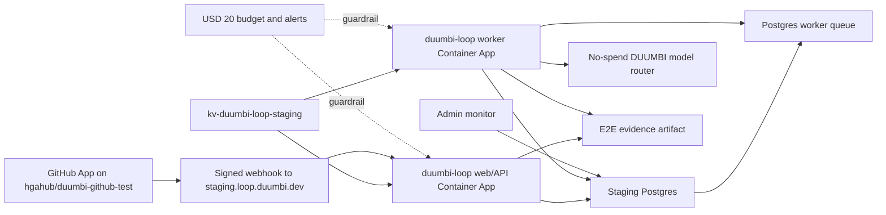

# DUUMBI-765 Technical Spec: Hosted GitHub App Staging E2E And Controlled Worker Enablement

Related to #765

Workflow note: this is a spec-only artifact. Any PR containing this document must
use non-closing issue references and must leave #765 open for Stage 10
implementation.

## Purpose

Prepare Stage 10 implementation for a bounded hosted staging proof of the real
optional GitHub App adapter and Postgres-backed async worker path.

The implementation must prove a signed GitHub webhook from the approved test
repository can enter `duumbi-loop` in Azure staging, create durable queue/run
evidence, run through an explicitly enabled no-spend worker E2E window, expose
admin monitor evidence, and return the worker to disabled or scale-to-zero
state.

This is not full DUUMBI Loop completion.

## Implementation Principles

- `provider-duumbi` remains the primary native path.
- GitHub remains optional, not a prerequisite.
- GitLab remains out of scope.
- DUUMBI-owned model labels remain the customer-facing contract.
- Raw provider/model SKUs must not appear in customer surfaces.
- Production auth is not introduced in this slice.
- Live Stripe products and live Stripe calls are not allowed.
- Live provider/model spend and external LLM calls are not allowed.
- Hosted worker execution requires explicit E2E approval and must be disabled
  afterward.
- No `pulumi up` may run until local/app gates pass and the user explicitly
  approves the hosted apply.
- No Ralph cycles are allowed.
- Greptile must not be invoked for spec PRs. For later implementation PRs,
  request at most one Greptile review per PR.

## Cross-Repo Ownership And PR Order

1. `hgahub/duumbi`: spec artifacts only for #765.
2. `hgahub/duumbi-loop`: staging deploy-contract gaps, smoke/evidence endpoint
   additions, GitHub App staging config validation, worker toggle behavior,
   admin monitor evidence, tests, and evidence docs only if the current #763
   implementation is insufficient.
3. `hgahub/duumbi-infra`: Key Vault secret refs, Container App environment
   wiring, worker enablement controls, staging app settings, preview evidence,
   and optional apply only after explicit approval.
4. `hgahub/duumbi-web`: only if the public `/loop` route, navigation, or CTA
   copy needs a small staging handoff adjustment.
5. `hgahub/duumbi-registry`: read-only unless a blocking metadata boundary is
   discovered.
6. `hgahub/duumbi-vault`: curated references only; not runtime source of truth.

Recommended implementation PR order:

1. `duumbi-loop`: verify/add deploy-contract and evidence behavior required for
   hosted GitHub App smoke.
2. `duumbi-infra`: wire secrets, environment variables, worker controls, and
   preview evidence.
3. `duumbi-web`: only if copy or CTA changes are required after app/infra
   contract review.

## Verified Current Boundaries

### `hgahub/duumbi-loop`

The merged #763 implementation already provides:

- `GET /health`
- `GET /ready`
- `GET /ops/e2e-evidence`
- `POST /api/webhooks/github`
- GitHub App callback and provider connection surfaces
- repository registration/sync surfaces
- webhook signature verification and idempotency behavior
- ignored-delivery paths for unsupported, unregistered, disabled, no-annotation,
  empty-annotation, and credit-or-limit-blocked cases
- Postgres persistence for GitHub installation state, webhook deliveries, and
  loop worker jobs
- admin worker monitor route
- worker disabled unless `DUUMBI_LOOP_ENABLE_WORKER=true` and
  `DUUMBI_LOOP_WORKER_E2E_APPROVED=true`
- local no-spend worker execution helpers and tests

Stage 10 must avoid reimplementing those surfaces unless a hosted deploy
contract gap is found.

### `hgahub/duumbi-infra`

The #759 Azure staging boundary already defines:

- `rg-duumbi-loop-staging`
- `cae-duumbi-loop-staging`
- `ca-duumbi-loop-web-staging`
- `ca-duumbi-loop-worker-staging`
- `stduumbiloopstaging`
- `kv-duumbi-loop-staging`
- `log-duumbi-loop-staging`
- `staging.loop.duumbi.dev`
- USD 20/month non-prod Loop budget with 50/80/100 alerts
- web and worker max replicas 1
- worker disabled by default
- `DUUMBI_LOOP_DATABASE_URL` supplied through Key Vault secret reference

The local `duumbi-infra` checkout may contain unpushed operator config or
Pulumi stack changes. Implementation agents must inspect status and avoid
overwriting unrelated local changes.

### `hgahub/duumbi-web`

The public `/loop` route already exists and states that DUUMBI Loop is staged,
GitHub/GitLab are optional adapters, and full product completion is not
claimed. No public web change is required by default.

## Architecture



## API, Deploy, And Secret Boundaries

### Hosted App Contract

Required public/staging endpoints:

```text
GET /health
GET /ready
GET /ops/e2e-evidence
POST /api/webhooks/github
GET /api/admin/orgs/{org_id}/worker-jobs
```

Required staging behavior:

- `/ready` reports environment, persistence backend, model router mode, worker
  enabled state, worker E2E approval state, Stripe mode, and safe warnings.
- `/ops/e2e-evidence` reports no-spend guardrails and must not expose secrets
  or raw webhook payloads.
- `POST /api/webhooks/github` requires a configured webhook secret and valid
  HMAC signature for live staging intake.
- Admin monitor requires authenticated/admin access; if staging still uses a
  local auth adapter, evidence must state that production auth is not enabled.

### Required Staging Environment Variables

Non-secret values:

```text
DUUMBI_LOOP_ADDR=0.0.0.0:8080
DUUMBI_LOOP_ENV=staging
DUUMBI_LOOP_MODEL_ROUTER=no_spend
DUUMBI_LOOP_STRIPE_MODE=test
DUUMBI_LOOP_ENABLE_WORKER=false
DUUMBI_LOOP_WORKER_E2E_APPROVED=false
DUUMBI_LOOP_GITHUB_LIVE_ADAPTER_ENABLED=true
DUUMBI_LOOP_GITHUB_ALLOWED_REPOSITORIES=hgahub/duumbi-github-test
```

Worker E2E window values, only during explicit E2E:

```text
DUUMBI_LOOP_ENABLE_WORKER=true
DUUMBI_LOOP_WORKER_E2E_APPROVED=true
DUUMBI_LOOP_WORKER_ID=worker_staging_e2e
DUUMBI_LOOP_WORKER_MAX_ATTEMPTS=2
DUUMBI_LOOP_WORKER_TASK_TIMEOUT_SECONDS=<bounded value>
DUUMBI_LOOP_WORKER_POLL_INTERVAL_MS=<bounded value>
DUUMBI_LOOP_WORKER_LEASE_SECONDS=<bounded value>
```

Secret values must use Key Vault / Container App secret refs:

```text
DUUMBI_LOOP_DATABASE_URL
DUUMBI_LOOP_GITHUB_APP_ID
DUUMBI_LOOP_GITHUB_CLIENT_ID
DUUMBI_LOOP_GITHUB_CLIENT_SECRET
DUUMBI_LOOP_GITHUB_APP_PRIVATE_KEY
DUUMBI_LOOP_GITHUB_WEBHOOK_SECRET
```

If the current app expects `_REF` variables for some secrets, Stage 10 may
either preserve that contract or add a backward-compatible secret resolution
layer. It must not commit raw secrets.

### Key Vault Secret Names

Recommended Key Vault secret names:

```text
duumbi-loop-database-url
duumbi-loop-github-app-id
duumbi-loop-github-client-id
duumbi-loop-github-client-secret
duumbi-loop-github-app-private-key
duumbi-loop-github-webhook-secret
```

Pulumi outputs may expose only secret names or configured/missing status, never
secret values.

### GitHub App Staging Credential Policy

- Use a non-production GitHub App.
- Install only on `hgahub/duumbi-github-test` for this slice.
- Use repository-scoped permissions only.
- Do not use production GitHub App credentials.
- Do not use personal access tokens for runtime adapter behavior.
- Installation tokens must be short-lived and never stored in normal database
  fields, logs, PRs, issues, or evidence artifacts.
- Private key material must remain in Key Vault or approved secret storage.
- Rotation must be possible by updating Key Vault/Pulumi secret config without
  source changes.

Minimum permissions for this slice:

- metadata read,
- contents read only if needed for source context,
- issues read where issue comments are used,
- pull requests read where PR comments are used,
- webhook event delivery for issue comments, pull request comments, pull
  request review comments, installation, repository, and push events as
  required by the existing #763 adapter.

No repository write permission is required.

## Data Model Boundaries

This slice must use the existing #763 Postgres model where possible:

- provider connections,
- repository registrations,
- GitHub App installation state,
- GitHub webhook deliveries,
- task requests,
- runs,
- run events,
- artifacts,
- loop worker jobs,
- credit ledger,
- audit events.

Additive migrations are allowed only when hosted staging exposes a concrete
missing field, such as:

- staging repository allowlist evidence,
- E2E worker window timestamps,
- secret configuration status,
- worker disable/teardown evidence.

Do not replace the Postgres-backed queue with an external queue service in this
slice.

## Webhook Security, Replay, And Idempotency

Implementation must verify:

- `X-Hub-Signature-256` is present and valid,
- webhook secret is configured in live staging,
- delivery id is present,
- event/action is allowlisted,
- installation id maps to an enabled provider connection,
- repository maps to an enabled registered repository,
- repository full name is allowlisted for this slice,
- duplicate delivery ids are idempotently ignored,
- malformed or empty annotations return safe non-queued responses,
- invalid signatures do not write task requests, runs, artifacts, or worker
  jobs.

Evidence must include delivery statuses without raw payload bodies.

## Worker Enablement And State Requirements

Default hosted state:

- worker Container App deployed only if required by the existing infra contract,
- min replicas 0 where compatible,
- max replicas 1,
- `DUUMBI_LOOP_ENABLE_WORKER=false`,
- `DUUMBI_LOOP_WORKER_E2E_APPROVED=false`,
- no worker execution outside explicit E2E.

E2E enabled state:

- operator explicitly approves apply/config update,
- worker enabled and E2E approved,
- max replicas remains 1,
- no-spend router remains active,
- one staged queue item is processed,
- worker is disabled or scaled to zero after evidence.

Required state behavior:

- queued jobs can be claimed once,
- running jobs record lease owner and timeout,
- retry attempts are bounded,
- cancellations release reserved credits when no billable work occurred,
- stale leases are recovered or failed according to policy,
- terminal failures release reservations when appropriate,
- admin monitor shows queue depth, active leases, blocked jobs, failed jobs, and
  recent attempts.

## Security And Privacy Requirements

- Do not expose raw secrets in source, logs, Pulumi output, issue comments, PR
  bodies, screenshots, or evidence docs.
- Do not store raw GitHub private keys or installation tokens in regular DB
  columns.
- Do not log raw webhook payloads or source content.
- Store only bounded, sanitized hashes or summaries for webhook evidence.
- Reject unallowlisted repositories.
- Do not use production auth, production GitHub App credentials, live Stripe,
  or live provider/model keys.
- Evidence must distinguish GitHub runtime credentials from GitHub CLI/API use
  for PR/issue coordination.
- Admin monitor must remain admin-only.

## Billing And Cloud-Cost Constraints

- Stripe test mode only.
- Live Stripe calls: 0.
- Live provider/model spend: 0.
- External LLM calls: 0.
- Azure non-prod Loop budget remains USD 20/month with 50/80/100 alerts.
- Worker max replicas 1.
- Worker min replicas 0 or disabled outside E2E.
- Hosted E2E must stop if budget, alert, DB, secret, DNS, or worker controls
  are missing.
- Teardown/disable evidence is required after hosted E2E.

## BDD-To-Test Mapping

| BDD Scenario | Test Or Evidence | Repo |
| --- | --- | --- |
| Native DUUMBI remains available without GitHub | Existing or added route/API test showing provider-duumbi remains available when GitHub live adapter is disabled. | `duumbi-loop` |
| Operator configures a non-production GitHub App | Infra preview/evidence showing secret refs and configured/missing status without raw values. | `duumbi-infra` |
| Test repository is allowlisted | Unit/integration test or config test rejects non-`hgahub/duumbi-github-test` repository in staging mode. | `duumbi-loop` |
| Staging webhook requires a valid signature | Existing #763 webhook tests plus hosted smoke invalid-signature check if safe. | `duumbi-loop` |
| Duplicate webhook delivery is idempotent in staging | Existing #763 integration test plus hosted evidence for one accepted and one duplicate delivery. | `duumbi-loop` |
| Empty annotation does not retry forever | Existing regression test for `ignored_empty_annotation`; hosted evidence optional. | `duumbi-loop` |
| Annotation queues hosted staging work | Hosted E2E evidence from `hgahub/duumbi-github-test` showing task, run, delivery, and queued job. | `duumbi-loop` |
| Worker remains disabled by default | `/ready`, `/ops/e2e-evidence`, and Pulumi preview evidence assert disabled or scaled-to-zero worker. | `duumbi-loop`, `duumbi-infra` |
| Worker runs only during approved E2E | Hosted E2E evidence showing approval window, worker enabled, one job processed, no-spend router active. | `duumbi-loop`, `duumbi-infra` |
| Worker disable is verified after E2E | Post-E2E `/ready`, `/ops/e2e-evidence`, or Pulumi output shows disabled/scaled-to-zero state. | `duumbi-loop`, `duumbi-infra` |
| Billing and cloud cost gates fail closed | Tests/evidence show missing budget/secret/DB gates block hosted smoke before spend or worker execution. | `duumbi-infra`, `duumbi-loop` |
| Admin can inspect queue and provider evidence | Admin monitor test and hosted screenshot/API evidence with sanitized payload summaries. | `duumbi-loop` |

## Verification Plan

### `duumbi-loop`

Run when any app/API/deploy-contract code changes are made:

```text
cargo fmt --check
cargo clippy --all-targets -- -D warnings
cargo test
```

If Postgres-specific hosted-staging behavior changes:

```text
DUUMBI_LOOP_RUN_POSTGRES_TESTS=1 \
DUUMBI_LOOP_DATABASE_URL='<redacted local or staging-safe Postgres URL>' \
cargo test
```

Expected focused coverage:

- GitHub allowed repository config parsing,
- non-allowlisted repository blocked before queueing,
- secret status/evidence endpoint redaction,
- worker E2E approval guard,
- no-spend router remains active during worker enablement,
- admin monitor remains available and sanitized.

### `duumbi-infra`

Run for infra changes:

```text
npm install
npx tsc --noEmit
pulumi preview --stack loop-staging --non-interactive
```

Do not run `pulumi up` unless the user explicitly approves it after preview.

Expected preview evidence:

- Key Vault secret names present,
- Container App secret refs present,
- no raw secret values in outputs,
- worker disabled by default,
- worker max replicas 1,
- budget and 50/80/100 alerts present,
- database secret configured as real Pulumi secret before hosted smoke,
- staging custom domain remains `staging.loop.duumbi.dev`.

### `duumbi-web`

Only if public route/CTA changes are made:

```text
npm run build
npm run verify:loop-route
```

## Live Hosted E2E Plan

### Phase 0: Stop Gate Review

Before any hosted apply or worker enablement, verify:

- user explicitly approves Azure apply,
- `duumbi-infra:loopDatabaseUrl` is configured as a real Pulumi secret,
- GitHub App staging secrets are configured as secret refs,
- budget alerts are configured,
- DNS/custom domain is healthy,
- worker remains disabled by default,
- no-spend model router is configured,
- test repository is `hgahub/duumbi-github-test`.

If any item is missing, stop with findings.

### Phase 1: Local/Staging Contract Verification

1. Verify `duumbi-loop` local checks.
2. Verify `/ready` and `/ops/e2e-evidence` in local or existing staging mode.
3. Verify worker disabled evidence.
4. Verify fake GitHub webhook and worker tests still pass.

### Phase 2: Infra Preview

1. Run TypeScript check.
2. Run Pulumi preview for `loop-staging`.
3. Confirm approved resources only.
4. Confirm secret refs, budget, worker controls, custom domain, and no raw
   secret outputs.

### Phase 3: Explicit Hosted Apply Gate

Stop and ask for explicit approval before `pulumi up`.

If approval is not granted, record preview-only findings and do not continue to
hosted smoke.

### Phase 4: Hosted Webhook Intake Smoke

After approved apply:

1. Confirm `https://staging.loop.duumbi.dev/health`.
2. Confirm `https://staging.loop.duumbi.dev/ready`.
3. Confirm `https://staging.loop.duumbi.dev/ops/e2e-evidence`.
4. Install/configure the non-production GitHub App only on
   `hgahub/duumbi-github-test`.
5. Register the repository in staging.
6. Send or trigger a signed `@duumbi-loop` annotation.
7. Verify one webhook delivery, one task request, one run, and one queued job.
8. Verify duplicate delivery is ignored if safe to replay.

### Phase 5: Controlled Worker E2E Window

1. Ask for explicit approval to enable worker E2E.
2. Enable worker with `DUUMBI_LOOP_ENABLE_WORKER=true` and
   `DUUMBI_LOOP_WORKER_E2E_APPROVED=true`.
3. Confirm max replicas 1 and no-spend model router.
4. Let one queued job run to review/completed/failed/blocked.
5. Capture run events, artifacts, admin monitor, and no-spend evidence.
6. Disable or scale worker to zero immediately after evidence.

### Phase 6: Post-E2E Disable Evidence

Verify:

- worker disabled or scaled to zero,
- no worker execution outside explicit E2E,
- live Stripe calls = 0,
- live provider/model spend = 0,
- external LLM calls = 0,
- production auth = 0,
- GitHub production credentials = 0,
- Ralph cycles = 0.

## Ralph Cycle Resource Policy

- Spec PRs: Ralph cycles = 0.
- Implementation PRs: Ralph cycles = 0 unless a later issue explicitly changes
  policy.
- External LLM call cap: 0.
- Live provider/model spend cap: 0.
- Live Stripe call cap: 0.
- GitLab credential use cap: 0.
- GitHub runtime credential use is limited to the non-production GitHub App
  installed on `hgahub/duumbi-github-test` for the approved hosted E2E window.
- Worker execution is allowed only during an explicit E2E window and must return
  to disabled or scale-to-zero state afterward.
- Azure work requires explicit apply approval, budget evidence, and teardown or
  disable evidence.

## Stage 10 Implementation Prompt

```text
Run DUUMBI Stage 10 implementation for #765 using
specs/DUUMBI-765/PRODUCT.md and specs/DUUMBI-765/TECHNICAL.md.

Target issue: https://github.com/hgahub/duumbi/issues/765

Parent context:
- #738 delivered the provider-core/native CLI foundation.
- #750 delivered the first local/no-cost duumbi-loop web+infra slice.
- #757 delivered the first production-integration duumbi-loop slice.
- #759 delivered the public duumbi.dev Loop entry route and Azure staging boundary.
- #761 delivered authenticated repository/task/admin surfaces and Postgres persistence.
- #763 delivered the real optional GitHub App adapter boundary and Postgres-backed async worker queue.
- The full DUUMBI Loop product is not complete.

Goal:
Implement the next bounded DUUMBI Loop hosted GitHub App staging E2E and
controlled worker enablement slice:
- non-production GitHub App staging secret/config boundary,
- Key Vault and Container App secret refs for GitHub App and webhook settings,
- allowlisted repository `hgahub/duumbi-github-test`,
- hosted signed webhook intake at `staging.loop.duumbi.dev`,
- Postgres-backed task/run/event/artifact/worker evidence in staging,
- controlled worker enablement only during an explicit E2E window,
- admin monitor evidence for provider access, webhook deliveries, queue backlog,
  worker health, blocked/failed runs, and audit events,
- no-spend DUUMBI model routing for all hosted smoke,
- post-E2E worker disable, scale-to-zero, or teardown evidence.

Recommended PR order:
1. hgahub/duumbi-loop: only staging deploy-contract gaps, smoke/evidence endpoint
   additions, GitHub App staging config validation, worker toggle behavior, tests,
   and evidence docs if the current #763 implementation is insufficient.
2. hgahub/duumbi-infra: Key Vault secret refs, Container App env wiring, worker
   enablement controls, staging app settings, and Pulumi preview evidence.
3. hgahub/duumbi-web: only if public Loop copy/navigation/CTA needs adjustment.
4. Other repos only if a blocking contract gap is discovered and recorded.

Constraints:
- Do not claim the full DUUMBI Loop product is complete.
- GitHub remains optional, not a prerequisite.
- GitLab remains out of scope.
- provider-duumbi remains primary.
- DUUMBI-owned model labels remain the user-facing contract.
- No production auth.
- No live Stripe products or live Stripe calls.
- No live provider/model spend or external LLM calls.
- Do not expose raw provider/model SKUs to customers.
- Use only the non-production GitHub App and the allowlisted test repo
  `hgahub/duumbi-github-test` for hosted GitHub E2E.
- Do not use GitHub/GitLab production provider credentials.
- Do not run pulumi up until local/app gates are green, Pulumi preview is clean,
  and the user explicitly approves apply.
- Do not enable the hosted worker until the user explicitly approves the E2E
  window.
- Worker must be disabled or scaled to zero after E2E evidence.
- No Ralph cycles.
- Use non-closing references such as "Related to #765".
- Greptile is reserved for the final implementation PR review; request at most
  one Greptile review per PR.

Required verification:
- duumbi-loop cargo fmt --check, clippy, and tests if duumbi-loop changes.
- duumbi-loop focused tests for repository allowlist, webhook security,
  idempotency, worker approval guard, no-spend router, and sanitized evidence if
  those gaps are touched.
- duumbi-infra npx tsc --noEmit and pulumi preview for loop-staging if infra
  changes.
- duumbi-web build/route verification only if web changes.
- Hosted smoke only after explicit apply approval and real staging secrets are
  configured.
- Evidence file/comment recording external LLM calls = 0, live provider/model
  spend = 0, live Stripe calls = 0, production auth = 0, GitLab credentials = 0,
  GitHub runtime credentials limited to non-production GitHub App on
  hgahub/duumbi-github-test, worker execution outside explicit E2E = 0, and Ralph
  cycles = 0.

Stop with findings if GitHub App ownership, staging secrets, webhook security,
database access, cloud budget, worker cost, Azure ownership, domain/DNS,
provider routing, or cross-repo ownership creates a blocker.
```

## Codex Self-Review

### Product Gate

- The slice is bounded to hosted staging proof, not full product completion.
- The test repository is explicit: `hgahub/duumbi-github-test`.
- GitHub remains optional and GitLab remains out of scope.
- No production auth, live Stripe, live provider/model spend, raw SKU exposure,
  or Ralph cycles are required.

### Technical Gate

- Cross-repo ownership and PR order are explicit.
- Existing #763 `duumbi-loop` surfaces are reused instead of reimplemented.
- Secret refs, webhook security, replay/idempotency, worker approval, budget,
  and teardown gates are explicit.
- Pulumi apply and worker enablement both remain explicit approval gates.
- No unresolved architecture blocker remains for spec drafting. Missing live
  staging secrets are Stage 10 prerequisites and stop gates, not spec blockers.
